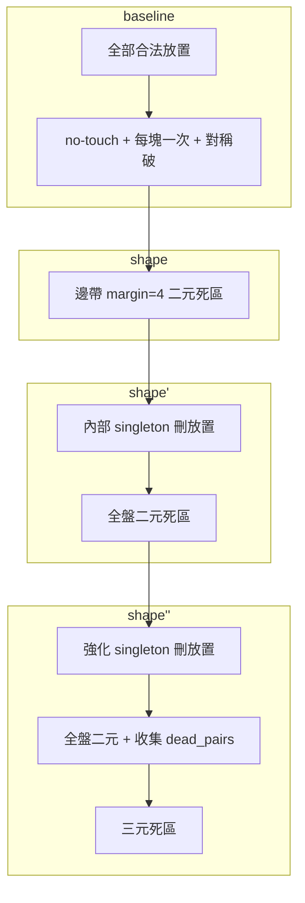
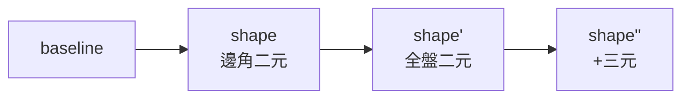

# 新拼圖實驗結果總整理

> 專案路徑：repository root
> 求解器：**Kissat**（使用 `--kissat`、`KISSAT` 環境變數或 `PATH` 指定）
> 棋盤：**12×12**，11 塊六格拼圖（每塊 6 格，共 66 格）  
> 最後更新：2026-06-03（補齊 v1 枚舉 + **方法原理**章節）  

---

## 1. 兩個拼圖

| 代號 | 名稱 | 定義檔 | 已知解 |
|------|------|--------|--------|
| **v1** | 我繪製的第一個拼圖（`new_puzzle`） | `encoding/puzzle_defs.py` → `PUZZLES["v1"]` | 有（同一定義檔） |
| **v2** | 我繪製的第二個拼圖 | `encoding/puzzle_defs.py` → `PUZZLES["v2"]` | 有（同一定義檔） |

### v1 十一塊名稱

加號臂、L形、2×2+尾、S+尾、寬T、寬S、鋸齒A、高L、S形、寬方塊、鋸齒B  

（v1 已知解中 **piece 8（S形）** 為唯一不貼邊的 interior 塊。）

### v2 十一塊名稱

寬鉤A、角階梯、寬鉤B、寬鉤C、缺角塊、角蛇形、底角L、高邊條、階梯L、直蛇、2×3塊  

---

## 2. 方法對照表

所有方法皆在 **no-touch（8-鄰不接觸）** + **每塊恰好放一次** + **piece 0 對稱破（上半盤）** 之上疊加剪枝。  
**原理說明**（死區、singleton、三元子句為何合法）：見 **§3 方法原理**。

| 代號 | 程式參數 | 放置列舉 | 主要剪枝 | 公平性備註 |
|------|----------|----------|----------|------------|
| **baseline** | `baseline` | 全部合法放置 | 無 | 公平基準 |
| **soft** | （舊腳本 `soft` / 早期 `soft_prune`） | **刪除**不貼邊放置 | 「至少一格貼邊」，且 **豁免** 已知解中的 interior 塊 | **不公平**：依賴已知解結構 |
| **shape** | `shape` | 與 baseline **相同** | 邊角 **margin=4** 內 **二元** dead-pocket | 公平（不豁免 piece） |
| **shape'** | `shape_prime` | 與 baseline 相同（v1/v2 各刪 **0**） | **內部封閉** singleton + **全盤**二元 dead-pocket（`edge_margin=6`） | 公平 |
| **shape''** | `shape_prime2` | singleton 強化（各刪 **256**） | shape' 的二元 + **三元** dead-pocket | 公平；CNF 前處理很慢 |

### 實驗類型

| 類型 | 說明 | 指標 |
|------|------|------|
| **單次「下一解」** | 先封鎖**一條**已知解，再跑 Kissat 找**另一個** SAT 解 | 單次 wall time |
| **枚舉 5 解（公平版）** | 先封鎖已知解的 **D4 對稱（8 變換）**，再連續找 5 解；每解再封鎖其 D4 | **平均** Kissat 時間 ± 標準差 |

> **不要**把「單次下一解 + soft（砍半放置）」與「枚舉 5 解 + 全放置」的加速比直接對比。

---

## 3. 方法原理

本章說明各編碼在 **baseline SAT 模型** 之上做了什麼、為何合法、以及 Kissat 為何可能變快或變慢。實作見 `encoding/generate_cnf.py`、`shape_prime.py`、`shape_prime2.py`。

### 3.1 共同基礎（baseline）

**變數**：每個「合法放置」`placement` 一個布林變數 `p`；`p=True` 表示採用該放置。

**硬約束**（所有公平方法共用，放置列舉相同）：

| 編號 | 約束 | CNF 形式（直覺） |
|------|------|------------------|
| 1 | 每塊恰好放一次 | 對 piece `i`：至少一個放置為真 + at-most-one（sequential encoding） |
| 2 | 格子不重疊 | 同一格 `(r,c)` 上不同 piece 的放置變數兩兩 `¬va ∨ ¬vb` |
| 3 | **No-touch** | 8-鄰域內不同 piece 的放置不能同時為真（比「不重疊」更嚴） |
| 4 | 對稱破（piece 0） | piece 0 的放置若超出上半盤 → 強制 `¬p` |

**排除區（exclusion zone）**：一塊若佔據格集合 `S`，則其 8-鄰包絡（含自身）為禁止其他 piece 佔用的區域。No-touch 子句保證不會有兩個變數同時覆蓋相鄰不同 piece 的格。

**baseline** 不做幾何預剪：v1 約 **7464**、v2 約 **6120** 個放置變數，SAT 直接在完整搜尋空間上找解。

### 3.2 soft（開發期，不公平）

**做法**：列舉後**刪除**「六格全不貼棋盤邊」的放置；並對已知解中的 **interior 塊**（v1 的 piece 8、v2 的 2/3/9）**豁免**貼邊要求。

**效果**：放置數約減半（v1：7464→3232），CNF 大幅變小，Kissat 通常很快。

**為何不與公平實驗混比**：剪枝依賴**題目 + 已知解結構**，不是只依幾何；找到的解空間與「全放置 + 純幾何子句」不同。

### 3.3 shape（邊角二元死區）

**核心想法**：若兩塊**不衝突**的放置同時成立，卻在棋盤上留下 **&lt; 6 格** 的 **4-連通空腔**，則該空腔無法再容納任何六格塊（本題每塊固定 6 格）→ 此組合不可能是完整 11 塊解的一部分，可預先加子句禁止。

**死區判定** `has_dead_pocket(A, B)`：

1. 令 `forbidden = exclusion(A) ∪ exclusion(B)`，其餘為 `free`。
2. 對 `free` 做 4-連通分量分解。
3. 若存在 `1 ≤ |分量| < 6`，回傳真。

**Pairwise 子句**：對所有不同 piece 的放置對 `(pi, pj)`，若幾何上可同放（互不佔 exclusion）且 `has_dead_pocket` 為真，加入：

```text
¬pi ∨ ¬pj
```

**shape 特有篩選**（`edge_margin=4`）：

- 只考慮「至少一塊的格點落在邊帶」的配對：距離四邊 &lt; 4 的區域。
- 理由：兩塊都遠離邊界時，很難在局部形成會卡死六格塊的小空腔；全盤掃描成本高且邊際收益小。

**不刪 placement**：變數個數與 baseline 相同，僅**加幾百萬條**二元子句，讓 CDCL 在搜尋中更早衝突。

**實測**：v2 公平枚舉約 **1.21×**；v1 約 **1.34×**（子句數與 shape' 在 v1 上相同，見下）。

### 3.4 shape'（shape_prime：內部 singleton + 全盤二元）

在 shape 的 pairwise 思路上做兩點加強：

#### （1）Singleton — 內部封閉死區（刪 placement）

**只放一塊**時檢查：若 `free = 全盤 \ exclusion(該塊)` 中存在 **不貼棋盤邊** 且 **&lt; 6 格** 的 4-連通分量 → **刪除**該 placement 變數（不進 CNF）。

與 shape'' 的差異：shape' 只刪「**內部**」小空腔（分量中至少一格不在邊界）；**貼邊**的 1～5 格窄縫保留，避免誤刪 v2 已知解等合法放置。

**v1 / v2 枚舉**：此規則各刪 **0** 個放置（11 塊在已知解中的合法放置都通過檢查）。

#### （2）全盤二元死區（`edge_margin=6`）

對**所有**不衝突的跨 piece 放置對做 `has_dead_pocket`（不再限邊角 4 格帶），同樣輸出 `¬pi ∨ ¬pj`。

在 **12×12** 上，`margin=4` 與 `margin=6` 對 **v1、v2 產生的二元子句集合相同**（v2：**+1,473,160**；v1：**+1,881,352**），故 **shape 與 shape' 的 base CNF 一致**（v2 上檔案 MD5 相同）。**2026-06-04 重跑** v2 枚舉：shape **9.7 s**、shape' **11.3 s**，同級而非舊表 **23.8 s vs 7.4 s**。



### 3.5 shape''（shape_prime2：強化 singleton + 三元死區）

#### （1）強化 singleton

**只放一塊**時：若 `free` 中**任意** 4-連通分量 **&lt; 6 格**（**含貼邊**窄縫）→ 刪除該 placement。

**效果**：v1 / v2 各刪 **256** 個放置（約 3.4%～4.2% 變數），CNF 略小。

#### （2）全盤二元死區

與 shape' 相同（`edge_margin=6`），並**記錄**已產生二元子句的 `(vi, vj)` 集合 `dead_pairs`，供三元階段跳過（避免重複工作）。

#### （3）三元死區（局部、三塊）

**動機**：有些配置兩兩同時放仍不觸發二元死區，但**三塊一起**會把某區域壓成 &lt; 6 格空腔。

**搜尋範圍**（控制組合爆炸）：

- 枚舉三個不同 piece `(i, j, k)`。
- 固定 `A ∈ piece i`；在 `j` 中只取與 `A` 中心 **Chebyshev 距 ≤ 5** 的放置 `B`。
- 若 `(A,B)` 已在 `dead_pairs` 或幾何衝突 → 跳過。
- 若 `A∪B` 單獨已產生 &lt;6 空腔 → 跳過（二元已涵蓋）。
- 否則在 `A∪B` 留下的「可疑空腔」附近（膨脹 2 格）只考慮 piece `k` 的候選 `C`；若 `A∪B∪C` 的最小空腔 &lt; 6 → 加：

```text
¬va ∨ ¬vb ∨ ¬vc
```

**成本**：前處理需掃描千萬～三千萬組候選（v2 約 **27 min** / v1 約 **53 min**），產生 **653 萬～1246 萬** 條三元子句。

**求解效果依題而定**：

| 題目 | 為何 |
|------|------|
| **v2** | shape' 已將平均時間壓到 ~7 s；三元子句進一步砍掉三分支衝突，約再快 **10%**（**≈4.3×** vs baseline） |
| **v1** | shape' 幾乎無 singleton 收益、二元與 shape 相同；大量三元子句增加傳播開銷，**搜尋樹縮得不多** → 平均 **32 s**，比 baseline **慢**（見 §6.1） |

### 3.6 子句語意與正確性直覺

| 子句 | 語意 |
|------|------|
| `¬pi ∨ ¬pj` | 禁止 placements `pi` 與 `pj` **同時**為真 |
| `¬pi ∨ ¬pj ∨ ¬pk` | 禁止三者同時為真 |

皆為 baseline 可行解集合的**子集**（只刪掉不可能延伸成 11 塊完整鋪設的組合），故 **SAT 仍 sound**：有解則解仍滿足 no-touch 與每塊一次；可能 **incomplete** 若某條件過強，但本實驗中枚舉出的解均 `valid=True`。

### 3.7 方法演進一句話

| 代號 | 一句話 |
|------|--------|
| baseline | 全放置 + 純 SAT 約束 |
| soft | 砍半放置 + 已知 interior 豁免（不公平） |
| shape | 邊角附近的「兩塊就會留下死腔」二元禁止 |
| shape' | 刪內部死腔單塊放置 + 全盤兩塊死腔二元禁止 |
| shape'' | 再刪貼邊小縫單塊 + 全盤二元 + 三塊聯合死腔三元禁止 |

**實務**：公平枚舉優先 **shape'**；**shape''** 需接受長前處理，且應**按題實測**（v1 不建議）。

---

## 4. 拼圖 v1（第一個拼圖）結果

### 4.1 CNF 規模（`encoding/cnf/new_puzzle/`）

| 方法 | Placements | 變數數 | Base 子句數 | 備註 |
|------|------------|--------|-------------|------|
| baseline | **7,464** | 14,917 | **65,139,812** | 未對 v1 跑 Kissat（過大） |
| soft | **3,232** | 6,453 | **9,921,852** | piece 8 貼邊豁免 |
| shape | **3,232** | 6,453 | **10,462,948** | soft 放置 + **541,096** 條死區子句 |

- 形狀分析的開發期版本來自我上學期的
  [`untouchable11-sat`](https://github.com/Michaelwu128/untouchable11-sat) 專案，
  後來已併入本專案邏輯。

### 5.2 單次求解：封鎖已知解後找「下一個解」

| 方法 | seed=1 (s) | 備註 |
|------|------------|------|
| soft | **3.20** | `baselines/new_puzzle/soft_time.txt` |
| shape | **2.03** | `baselines/new_puzzle/shape_time.txt` |

**多 seed 比較**（同一 CNF，開發期實測，僅 soft vs shape）：

| seed | soft (s) | shape (s) | shape/soft |
|------|----------|-----------|------------|
| 1 | 3.10 | 2.11 | 1.5× |
| 2 | 10.24 | 0.92 | 11× |
| 3 | 4.55 | 2.65 | 1.7× |
| 4 | 3.01 | 2.03 | 1.5× |
| 5 | 10.30 | 2.85 | 3.6× |
| **幾何平均** | — | — | **≈ 2.8×** |

- 解檔：`baselines/new_puzzle/soft_sol.txt`、`shape_sol.txt`  

### 4.3 公平枚舉實驗（5 解 + D4，全方法 7464/7208 放置）

**設計**：與 v2 相同——無 soft、無 piece 豁免；先封鎖我提供的已知解之 D4；各方法連找 **5** 解。
**指令**：`python3 run_enum_benchmark.py --puzzle v1 --count 5`  
**詳細 JSON**：`baselines/v1/enum_v2/results.json`  
**摘要**：`baselines/v1/enum_v2/RESULTS.md`  

> 產物目錄名為 `enum_v2/`（與 v2 共用腳本預設路徑），內容為 **v1** 結果。

#### CNF 規模（enum 產生的 base CNF）

| 方法 | Placements | Base 子句數 | 相對 baseline 額外子句 |
|------|------------|-------------|------------------------|
| baseline | **7,464** | **65,139,811** | — |
| shape | 7,464 | **67,021,163** | **+1,881,352**（邊角 margin=4 二元死區） |
| shape' | 7,464 | **67,021,163** | **+1,881,352**（全盤二元；v1 singleton 刪 **0**） |
| shape'' | **7,208** | **74,499,229** | **+9,359,418**（二元 **606,696** + 三元 **12,462,954**） |

#### Kissat 平均時間（5 解）

| 方法 | 各次 (s) | **平均 (s)** | 標準差 | vs baseline |
|------|----------|--------------|--------|-------------|
| baseline | 9.31, 14.72, 5.97, 36.10, 26.21 | **18.463** | 12.498 | 1.00× |
| shape | 11.95, 15.81, 11.97, 13.87, 15.36 | **13.792** | 1.820 | **≈1.34×** |
| shape' | 11.57, 15.68, 12.19, 14.69, 15.21 | **13.868** | 1.861 | **≈1.33×** |
| shape'' | 28.30, 32.78, 34.21, 35.14, 31.79 | **32.445** | 2.652 | **≈0.57×（變慢）** |

- 驗證：**5/5** 解皆通過 no-touch（四種方法皆然）。
- **與 v2 對照**：v1 上 **shape' 幾乎無 singleton 剪枝**（刪 0 放置），全盤二元與 shape（邊角）子句數相同，加速僅 **~1.3×**；**shape''** 雖刪 256 放置，但三元子句極多，Kissat 反而比 baseline **慢約 1.75×**。

#### shape' / shape''（v1）靜態特性

| 方法 | Singleton 刪除數 | 備註 |
|------|------------------|------|
| shape' | **0** | 內部封閉規則不刪 v1 已知解的 11 塊放置 |
| shape'' | **256** | 強化 singleton（任何 &lt;6 空腔，含貼邊） |

#### shape'' 前處理紀錄（v1 本次跑完）

```
[shape''] 強化 singleton 刪除 256 個 placement → 7208 placements
[shape''] 二元死區 606,696 條
[shape''] 三元死區：檢查 30,949,350 組 → 12,462,954 條子句，耗時 3165.8 s（≈53 分鐘）
寫出 shape_prime2_base.cnf：14405 vars, 74499229 clauses
5 解 kissat：28.30, 32.78, 34.21, 35.14, 31.79 s → 平均 32.445 s
```

---

## 5. 拼圖 v2（第二個拼圖）結果

### 5.1 CNF 規模（靜態 `encoding/cnf/v2/`，單次實驗用）

| 方法 | Placements | 變數數 | 子句數 | 備註 |
|------|------------|--------|--------|------|
| baseline | 6,120 | 12,229 | 44,201,652 | 全放置 |
| soft | **3,172** | 6,333 | 9,594,752 | 豁免 piece 2,3,9（v2 interior） |
| shape | 3,172 | 6,333 | 10,135,432 | +540,680 形狀子句 |

路徑：`baselines/v2/*.txt`。

### 5.2 單次求解：封鎖已知解後找「下一個解」

| 方法 | 時間 (s) | 檔案 |
|------|----------|------|
| baseline | **39.34** | `baselines/v2/baseline_time.txt` |
| soft | **8.04** | `baselines/v2/soft_time.txt` |
| shape | **2.73** | `baselines/v2/shape_time.txt` |

相對 baseline 單次加速（**含 soft 砍放置，僅供歷史參考**）：

- soft ≈ **4.9×**
- shape ≈ **14.4×**

### 5.3 公平枚舉實驗（5 解 + D4，全方法 6120/5864 放置）

**設計**：無 soft、無 piece 豁免；先封鎖我提供的已知解之 D4；各方法連找 **5** 解。
**指令**：`encoding/run_enum_benchmark.py --puzzle v2 --count 5`  
**詳細 JSON**：`baselines/v2/enum_v2/results.json`  
**摘要**：`baselines/v2/enum_v2/RESULTS.md`  
**CNF build 公平對照**（2026-06-18）：`baselines/v2/cnf_build_fair/cnf_build_fair_compare.json`、`RESULTS.md`  
**指令（build）**：`encoding/run_cnf_build_fair_compare.py --puzzle v2`

#### CNF 規模（enum 產生的 base CNF）

| 方法 | Placements | Base 子句數 | 相對 baseline 額外子句 |
|------|------------|-------------|------------------------|
| baseline | 6,120 | 44,201,651 | — |
| shape | 6,120 | 45,674,811 | **+1,473,160**（邊角 margin=4 二元死區） |
| shape' | 6,120 | 45,674,811 | **+1,473,160**（全盤二元；v2 singleton 刪 0） |
| shape'' | **5,864** | **48,183,085** | **+3,981,434**（含二元 449,376 + 三元 **6,532,718**） |

> 在 12×12 上，shape 的 margin=4 與 shape' 的 margin=6 產生的 **二元子句集合相同**（子句數皆 +1,473,160）；`shape_base.cnf` 與 `shape_prime_base.cnf` **MD5 一致**。

#### CNF build 時間（公平對照，同一時段連續跑）

**run_at** = 2026-06-18 12:04–13:34（約 90 分鐘整輪；含 shape'' 三元子句）

| 方法 | `build_cnf` (s) | `write_cnf` (s) | 合計 (s) | vs baseline |
|------|-----------------|-----------------|----------|-------------|
| baseline | **17.1** | 9.4 | **26.5** | 1.00× |
| shape | **943.6** | 9.7 | **953.3** | **≈36×** |
| shape' | **1042.3** | 13.8 | **1056.2** | **≈40×** |
| shape'' | **3359.8** | 11.3 | **3371.0** | **≈127×** |

- 與 **D4 下一解**（不同協議，`baselines/v2/d4_next_sol_seeds/`）對照：baseline 13.3 s、shape 717.8 s、shape' 713.6 s、shape'' 2339.2 s——同方法 **略快或同級**，子句數與本表一致。
- shape'' 本次 `build_cnf` **56.0 min**（含 singleton 刪 256、二元、三元）；舊枚舉 log 僅記三元階段 **1608.8 s**（§ 下），非完整 `build_cnf`。

#### Kissat 平均時間（5 解）

| 方法 | 各次 (s) | **平均 (s)** | 標準差 | vs baseline |
|------|----------|--------------|--------|-------------|
| baseline | 12.309, 12.081, 15.374, 12.422, 11.705 | **12.778** | 1.477 | 1.00× |
| shape | 6.903, 8.148, 9.956, 10.501, 12.793 | **9.660** | 2.264 | **≈1.32×** |
| shape' | 7.261, 13.219, 11.893, 8.470, 15.513 | **11.271** | 3.395 | **≈1.13×** |
| shape'' | 7.012, 6.717, 6.524, 6.506, 6.612 | **6.674** | 0.207 | **≈1.91×** |

**2026-06-04 重跑** baseline / shape / shape'（Kissat 預設 seed=0；shape'' 沿用 2026-06-03）。舊表（baseline **28.7 s**、shape **23.8 s**、shape' **7.4 s**）為單次批次量測，與重跑結果差異大；**不宜**宣稱 shape' 因全盤二元比 shape 快 **3.9×**。

- 驗證：**5/5** 解皆通過 no-touch（四種方法皆然）。
- **shape'' vs shape'**：平均再快約 **10%**（7.38 s → 6.67 s），但 **build_cnf ≈ 56 min**（公平對照 3359.8 s）+ 更大 CNF 檔（`shape_prime2_base.cnf` 約 **數 GB 級**）。

#### shape'' 前處理紀錄

**2026-06-18 公平 build**（`run_cnf_build_fair_compare.py --puzzle v2`）：

```
build_cnf=3359.8 s（write 11.3 s）→ 5864 placements, 48,183,085 clauses
```

**2026-06-03 枚舉 run log**（僅三元階段計時摘錄）：

```
[shape''] 強化 singleton 刪除 256 個 placement → 5864 placements
[shape''] 二元死區 449,376 條
[shape''] 三元死區：檢查 15,467,558 組 → 6,532,718 條子句，耗時 1608.8 s
寫出 shape_prime2_base.cnf：11717 vars, 48183085 clauses
5 解 kissat：7.01, 6.72, 6.52, 6.51, 6.61 s → 平均 6.674 s
```

---

## 6. 方法演進與結論

### 6.1 v1 vs v2 公平枚舉對照（5 解 + D4）

| 方法 | v1 平均 (s) | v1 vs baseline | v2 平均 (s) | v2 vs baseline |
|------|-------------|----------------|-------------|----------------|
| baseline | **18.46** | 1.00× | **12.78** | 1.00× |
| shape | **13.79** | **≈1.34×** | **9.66** | **≈1.32×** |
| shape' | **13.87** | **≈1.33×** | **11.27** | **≈1.13×** |
| shape'' | **32.45** | **≈0.57×** | **6.67** | **≈1.91×** |

| 觀察 | 說明 |
|------|------|
| **v2 shape / shape' 等價 CNF** | 子句數相同；**2026-06-04 重跑** 求解時間同級（**~10 s**），舊表 shape' **3.9×** 不應再引用 |
| **v2 首選 shape''** | 刪 256 放置 + 三元子句；平均 **6.7 s（≈1.9× baseline）**，前處理成本高 |
| **shape'' 強依賴實例** | v2：三元 + 刪 256 放置 → **≈4.3×**；v1：三元子句 **1246 萬**（約 v2 的 **1.9×**）、前處理 **~53 min**，Kissat **變慢** |
| **baseline 難度不同** | v1 放置 **7464**、CNF **6514 萬**子句；v2 為 **6120** / **4420 萬**——單次求解時間不可直接橫比兩題 |



### 6.2 綜合建議

| 結論 | 說明 |
|------|------|
| **公平枚舉（v2，2026-06-04 重跑）** | baseline **12.8 s**；shape **9.7 s（≈1.32×）**；shape' **11.3 s（≈1.13×）**，與 shape **CNF 相同**；首選仍為 **shape''（≈1.91×，6.7 s）** |
| **v1 上 shape / shape' 略快** | 約 **1.3×**，邊角與全盤二元在此題上子句數相同 |
| **shape'' 僅在 v2 值得** | v2 再快 **~10%**；v1 上求解 **變慢**，前處理 **~53 min** |
| **soft 不應與公平實驗混比** | 放置數約減半 + interior piece 豁免 |

**實務建議（公平、可重現）**：以 **shape'** 為主力；**shape''** 依拼圖實測（v1 不建議）；開發期單次「下一解」可參考 soft/shape 小 CNF，但勿與枚舉結果混比。

---

## 7. 檔案與產物索引

### 程式

| 檔案 | 用途 |
|------|------|
| `encoding/puzzle_defs.py` | v1 / v2 拼圖定義 |
| `encoding/generate_cnf.py` | CNF 生成（baseline / shape / shape' / shape''） |
| `encoding/shape_prime.py` | shape' 邏輯 |
| `encoding/shape_prime2.py` | shape'' 邏輯 |
| `encoding/run_enum_benchmark.py` | 5 解枚舉 + D4 封鎖 |
| `encoding/solution_blocking.py` | D4 對稱封鎖子句 |

### v1 產物

| 路徑 | 內容 |
|------|------|
| `baselines/v1/enum_v2/results.json` | **完整**四方法 5 解（含棋盤 JSON） |
| `baselines/v1/enum_v2/RESULTS.md` | 四方法摘要表 |
| `baselines/v1/enum_v2/*_base.cnf` / `*_work.cnf` | 各方法 CNF（大型檔案） |
| `baselines/v1/enum_v2/*_sol_*.txt` | Kissat 原始輸出 |
| `baselines/new_puzzle/soft_sol.txt` / `shape_sol.txt` | 單次下一解（不公平 soft） |
| `baselines/new_puzzle/*_time.txt` | 單次計時 |
| `encoding/cnf/new_puzzle/*.cnf` | 靜態 CNF（小 placement 版） |

### v2 產物

| 路徑 | 內容 |
|------|------|
| `baselines/v2/enum_v2/results.json` | **完整**四方法 5 解（含棋盤 JSON） |
| `baselines/v2/enum_v2/RESULTS.md` | 四方法摘要表 |
| `baselines/v2/enum_v2/*_base.cnf` / `*_work.cnf` | 各方法 CNF（大型檔案） |
| `baselines/v2/enum_v2/*_sol_*.txt` | Kissat 原始輸出 |
| `baselines/v2/RESULTS.md` | 早期僅 baseline vs shape 摘要 |

### 靜態視覺化

v1/v2 的拼圖形狀與我提供的已知解整理於
[`docs/images/v1-v2-puzzles.svg`](docs/images/v1-v2-puzzles.svg)。
圖檔由 `tools/render_puzzle_overview.py` 直接讀取 `encoding/puzzle_defs.py` 產生，
避免視覺化資料與求解器使用的拼圖定義不同步。

---

## 8. 與其他專案的關係

| 專案 | 關係 |
|------|------|
| [`untouchable11-sat`](https://github.com/Michaelwu128/untouchable11-sat) | 我上學期研究的 11 塊 **不同** 拼圖；公開版包含 Model C 與其他棋盤尺寸的 benchmark |
| `learned-dead-pocket-sat/` | **本文件**所整理的兩個新手繪 12×12 拼圖 |

---

## 9. 重現指令速查

```bash
cd learned-dead-pocket-sat/encoding

# v1 / v2 公平枚舉（四方法）
python3 run_enum_benchmark.py --puzzle v1 --count 5
python3 run_enum_benchmark.py --puzzle v2 --count 5

# 單一方法
python3 run_enum_benchmark.py --puzzle v2 --count 5 --methods shape_prime2

# 僅生成 CNF
python3 generate_cnf.py --puzzle v2 --method shape_prime --out cnf/v2/shape_prime.cnf
```

---

## 10. 版本紀錄

| 日期 | 事件 |
|------|------|
| 2026-06-02 | v1 soft/shape 單次下一解；v2 不公平三方法單次比較 |
| 2026-06-02 | v2 公平枚舉 baseline vs shape（5 解 + D4） |
| 2026-06-02–03 | 新增 shape'、shape''；完成 v2 四方法枚舉 |
| 2026-06-03 | 本總整理文件建立 |
| 2026-06-03 | 完成 **v1** 四方法公平枚舉（`baselines/v1/enum_v2/`）；shape'' 前處理 ~53 min |
| 2026-06-03 | 新增 **§3 方法原理**（baseline / shape / shape' / shape''） |
