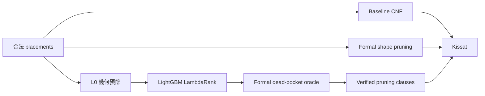

# Learning-Guided Dead-Pocket Pruning for SAT-Based Puzzle Solving

我以 12×12 no-touch 六格拼圖為研究案例，探索如何結合**幾何剪枝、機器學習排序與 SAT solver**，
降低 CNF 建構成本並加速多解枚舉。專案包含 6 組拼圖（v1–v6）、可重現的 benchmark、
formal dead-pocket oracle，以及不犧牲 SAT soundness 的 learned filtering pipeline。

## English abstract

I study SAT-based solving for 12×12 no-touch polyomino puzzles containing eleven
six-cell pieces. The direct placement encoding is expressive but produces tens of
millions of pairwise conflict clauses, while exhaustive geometric dead-pocket
analysis is expensive. I therefore compare formal dead-pocket pruning with a
learning-guided pipeline: a cheap geometric filter and a LightGBM LambdaRank model
prioritize placement pairs, and a formal oracle verifies every selected pair before
any pruning clause is added. This design preserves soundness—model false positives
cannot add invalid clauses, while false negatives only miss pruning opportunities.
Experiments across held-out puzzles show that no single method dominates every
workload: learned filtering can reduce preprocessing and match formal pruning on
selected next-solution tasks, whereas formal shape pruning gives the best cumulative
time in a 100-solution enumeration benchmark.

## 問題與動機

每題有 11 塊六格拼圖，所有拼圖塊都要放入 12×12 棋盤；不同拼圖塊之間不能重疊，
也不能在水平、垂直或對角方向接觸。我的 baseline 為每個合法 placement 建立布林變數，
再用 Kissat 求解 CNF。

這個表示法方便直接表達 placement 間的幾何關係，但 v1/v2 baseline 分別產生約
6,500 萬／4,400 萬條子句。我的研究問題是：

> 能否在不加入錯誤剪枝子句的前提下，減少昂貴的 dead-pocket 檢查，
> 並改善從 CNF 建構到多解枚舉的端到端時間？


## 方法



- **Formal shape / shape′ / shape″**：檢查一至三個 placements 是否形成小於六格、
  無法容納任何拼圖塊的 4-連通空腔，再加入合法的禁止子句。
- **L0**：不需訓練的低成本幾何分數，先保留較可能形成 dead pocket 的候選。
- **ML ranker**：使用 78 維 puzzle-invariant 特徵與 LightGBM LambdaRank，
  將有限 oracle budget 優先分配給高分 placement pairs。
- **Formal oracle gate**：只有 `has_dead_pocket` 確認為真才加入子句。
  ML 假陽性會被擋下；假陰性只會少做剪枝，不會讓 SAT 結果失去 soundness。

## 主要結果

以下結果來自不同評估協議，不能視為同一組直接排名；完整設定與原始表格可由連結追溯。

| 實驗 | 經驗證的結果 | 解讀 |
|---|---|---|
| v2 公平 D4 枚舉 5 解 | baseline 12.78 s、shape 9.66 s、shape″ 6.67 s（平均 Kissat 時間） | 更強剪枝可加速求解，但 shape″ 的 CNF build 約 56 分鐘 |
| v4 hold-out、v2-only L0@25% | build 約 1,809 s；SAT 21.4 s，對照 baseline 47.0 s、shape 24.1 s | 此設定同時降低 build 並略快於 full shape |
| v6 hold-out、v12345 L0@25% | D4 next-solution 31.2 s，接近 shape 32.3 s | 更多訓練拼圖改善下游 SAT，但 @25% recall 仍有限 |
| v6 連續枚舉 100 解（含一次 build） | baseline 4,330 s、learned 3,920 s、shape 3,749 s | shape 在 k=66 首次贏 baseline；learned 在 k=68 |


結論不是「ML 一定勝過 formal」。對只找少量解的工作，低 build 成本很重要；枚舉到約 70 解以上時，
formal shape 的一次性建構成本被攤平，累積時間反而最好。

## 術語

- **v1–v6**：六組 12×12 拼圖定義，位於 `encoding/puzzle_defs.py`。
- **v123 / v12345**：分別以 v1–v3／v1–v5 合併訓練的 ranker；評估拼圖不加入訓練集。
- **L0@25%**：先以 L0 cascade 縮小 ML 計算範圍，最後只把全部候選的 top 25% 送入 oracle。
- **Split-B**：早期 Random Forest 實驗中，將 v1+v2 混合後做 80/20 random split；不是目前的 LightGBM ranker。
- **sweep k\***：達到指定 clause recall 所需的最小 top-K%；**break-even k\***：
  `CNF build + 前 k 次 Kissat` 首次低於 baseline 的解數。兩者意義不同。

## 編碼選擇與限制

這個 repo 的 formal/learned dead-pocket 方法都直接作用在 placement 變數上，因此我在所有主要實驗中
沿用同一個 placement baseline，以隔離剪枝方法本身的差異。這不是最精簡的 CNF：
`generate_cnf.py` 直接為衝突 placements 產生二元子句，而且沒有去除重複子句。

我上學期的 [Model C](https://github.com/Michaelwu128/untouchable11-sat) 使用格子變數
`c(r,c,p)` 與 channeling；既有 12×12 紀錄為 12,905 variables、116,125 clauses。
該數字來自不同拼圖實驗線，只能說明編碼規模差異，不能直接當成本專案的效能對照。
未來工作是把 Model C 移植到同一組 v1–v6 實例，再公平比較 CNF build、Kissat 與 break-even；
本次公開整理不改寫 baseline 核心邏輯。

## 快速開始

需求：Python 3.10+、[Kissat](https://github.com/arminbiere/kissat)，以及
[`requirements.txt`](requirements.txt) 中的 ML 套件。

```bash
git clone https://github.com/Michaelwu128/new_puzzle_2026.git
cd new_puzzle_2026
python3 -m venv .venv
source .venv/bin/activate
pip install -r requirements.txt

# 若 kissat 已在 PATH，不需額外設定；也可指定：
export KISSAT=/path/to/kissat

cd encoding
python3 generate_cnf.py --puzzle v2 --method shape
python3 run_enum_benchmark.py --puzzle v2 --count 5 --methods baseline shape
```

ML 模型檔屬大型生成物，不直接納入 Git；可依
[`baselines/learned_shape/EXPERIMENTS_DETAILED.md`](baselines/learned_shape/EXPERIMENTS_DETAILED.md)
的資料建置與訓練指令重建。大型 oracle 標記、placement metadata 與 v6 解答見
[`ARTIFACTS.md`](ARTIFACTS.md)。

## 簡報

- [`2026-05-28：AI-assisted SAT for Untouchable 11`](slides/ai-assisted-sat-for-untouchable11-2026-05-28.pdf)
- [`2026-06-04：12×12 dead-pocket pruning progress`](slides/ai-assisted-12x12-puzzle-sat-2026-06-04.pdf)
- [`2026-06-18：Learned Dead-Pocket final presentation`](slides/ai-assisted-12x12-puzzle-sat-final-2026-06-18.pdf)

---

## 文件導覽（從哪裡讀起？）

| 你想知道… | 先讀這份 |
|-----------|----------|
| 整體方法、v1/v2 formal 實驗、公平枚舉 | [`EXPERIMENT_RESULTS.md`](EXPERIMENT_RESULTS.md) |
| ML / L0 / hold-out / break-even **簡報版** | [`baselines/learned_shape/REPORT.md`](baselines/learned_shape/REPORT.md) |
| 同上，**逐步實驗設計與重現** | [`baselines/learned_shape/EXPERIMENTS_DETAILED.md`](baselines/learned_shape/EXPERIMENTS_DETAILED.md) |
| v6 連續枚舉要幾解才贏 baseline？ | [`baselines/v6/break_even/RESULTS.md`](baselines/v6/break_even/RESULTS.md) |

---

## 重要 `.md` 一覽

### 總覽與方法原理

| 路徑 | 內容 |
|------|------|
| [`EXPERIMENT_RESULTS.md`](EXPERIMENT_RESULTS.md) | **Formal 實驗主文件**：拼圖 v1/v2、baseline / soft / shape / shape′ / shape″ 對照、方法原理（死區／singleton／三元子句）、公平枚舉 5 解 + D4、單次求解時間 |
| [`baselines/d4_next_sol_seeds/SUMMARY.md`](baselines/d4_next_sol_seeds/SUMMARY.md) | **D4 + 10 seed「下一解」** 實驗總整理（v1/v2 跨方法對照；協議說明） |

### Learned Dead-Pocket（AI + Oracle）

| 路徑 | 內容 |
|------|------|
| [`baselines/learned_shape/REPORT.md`](baselines/learned_shape/REPORT.md) | **簡版報告**：Pipeline（含 L0 cascade）、RF / Ranker LOO、v4–v6 hold-out、v12345、break-even、k\* 表；附目錄 |
| [`baselines/learned_shape/EXPERIMENTS_DETAILED.md`](baselines/learned_shape/EXPERIMENTS_DETAILED.md) | **詳解版**：資料集、訓練、sweep、SAT、L0 機制、hold-out 矩陣、break-even 協議、實驗總覽表、重現指令 |
| [`baselines/v4/l0_benchmark/v4_l0_compare_v2_vs_v123.md`](baselines/v4/l0_benchmark/v4_l0_compare_v2_vs_v123.md) | v4 上 **v2-only vs v123 合訓** ranker 的 build / SAT 並排 |
| [`baselines/v4/l0_benchmark/RESULTS.md`](baselines/v4/l0_benchmark/RESULTS.md) | v4 L0 / 無 L0 CNF 對照表與 JSON 索引 |
| [`baselines/v4/l0_benchmark/v4_v123_no_l0_k25.json`](baselines/v4/l0_benchmark/v4_v123_no_l0_k25.json) | v4 **v123 無 L0 @25%**（CNF build + SAT，2026-06-18） |
| [`baselines/v4/l0_benchmark/v4_v123_no_l0_k50.json`](baselines/v4/l0_benchmark/v4_v123_no_l0_k50.json) | v4 **v123 無 L0 @50%**（CNF only，2026-06-18） |
| [`baselines/v4/l0_benchmark/v4_v123_l0_k50.json`](baselines/v4/l0_benchmark/v4_v123_l0_k50.json) | v4 **v123 L0@50%**（CNF only，build **1233 s**，2026-06-18） |

### 各拼圖／各實驗的結果摘要

| 路徑 | 內容 |
|------|------|
| [`baselines/v1/d4_next_sol_seeds/RESULTS.md`](baselines/v1/d4_next_sol_seeds/RESULTS.md) | v1：D4 下一解（baseline / shape / shape′ / shape″） |
| [`baselines/v2/RESULTS.md`](baselines/v2/RESULTS.md) | v2：早期 baseline vs shape **5 解枚舉**（較早一版；完整四方法見 `EXPERIMENT_RESULTS.md` §5.3） |
| [`baselines/v2/d4_next_sol_seeds/RESULTS.md`](baselines/v2/d4_next_sol_seeds/RESULTS.md) | v2：D4 下一解（含各方法 `cnf_build_sec`） |
| [`baselines/v2/cnf_build_fair/RESULTS.md`](baselines/v2/cnf_build_fair/RESULTS.md) | v2：**同一時段**連續量測 baseline / shape / shape′ / shape″ 的 `build_cnf` 耗時 |
| [`baselines/v5/enum_v2/RESULTS_prune.md`](baselines/v5/enum_v2/RESULTS_prune.md) | v5：5 解枚舉（baseline / shape / learned） |
| [`baselines/v6/enum_v2/RESULTS_prune.md`](baselines/v6/enum_v2/RESULTS_prune.md) | v6：5 解枚舉（含 learned v123 / v12345 對照說明） |
| [`baselines/v6/enum_v2_v12345/RESULTS_prune.md`](baselines/v6/enum_v2_v12345/RESULTS_prune.md) | v6：learned-only（v12345 模型）5 解枚舉 |
| [`baselines/v6/break_even/RESULTS.md`](baselines/v6/break_even/RESULTS.md) | v6：**break-even** 累積時間表（build + 連續 k 解）；k\* vs baseline |
| [`baselines/v6/cnf_build_fair/RESULTS.md`](baselines/v6/cnf_build_fair/RESULTS.md) | v6：**同一時段**連續量測 baseline / shape / learned 的 `build_cnf` 耗時 |

## 目錄結構（精簡）

```
new_puzzle_2026/
├── README.md                 ← 本文件
├── EXPERIMENT_RESULTS.md     ← Formal 實驗總整理
├── encoding/                 ← CNF 生成、剪枝、benchmark 腳本
│   ├── generate_cnf.py
│   ├── learned_shape.py
│   ├── run_enum_benchmark.py
│   ├── run_break_even_benchmark.py
│   ├── run_v4_l0_benchmark.py
│   └── …
├── baselines/
│   ├── learned_shape/        ← ML 模型報告、sweep JSON、ranker
│   ├── v1/ v2/ … v6/        ← 各拼圖實驗產物（md + json）
│   └── d4_next_sol_seeds/    ← 跨拼圖 D4 實驗說明
├── docs/images/              ← README 靜態圖
├── slides/                   ← 三次專題簡報
└── tools/
    └── render_puzzle_overview.py
```

---

## 常用腳本（入口）

| 任務 | 腳本 |
|------|------|
| 產生 CNF | `encoding/generate_cnf.py --puzzle v2 --method shape` |
| 公平枚舉 N 解 | `encoding/run_enum_benchmark.py --puzzle v6 --count 5` |
| D4 + 10 seed 下一解 | `encoding/run_d4_next_sol_seeds.py` |
| Learned sweep / SAT | `encoding/run_learned_shape_benchmark.py` |
| v4/v5/v6 L0 端到端 | `encoding/run_v4_l0_benchmark.py --puzzle v6 --all` |
| v123 無 L0 CNF 補跑（v4） | `encoding/run_v4_v123_no_l0_chain.sh` |
| v6 break-even | `encoding/run_break_even_benchmark.py --puzzle v6 --k-max 100` |
| 公平 build 對照 | `encoding/run_cnf_build_fair_compare.py --puzzle v6` |

詳細參數與完整流程見 [`baselines/learned_shape/EXPERIMENTS_DETAILED.md`](baselines/learned_shape/EXPERIMENTS_DETAILED.md) §13。

---

## Git 與大型產物

`.gitignore` 排除體積過大的檔案，**不會**進 repo：

- `*.cnf`（單檔常數百 MB）
- `*.joblib`、 `*.csv`、 `*.log`
- `full_dead_v*.json`、`*_meta.json` 與 v6 break-even 的逐解 SAT assignment

Git 主要保留 **`.md` 文件**、**精簡結果 JSON**、圖表與 `encoding/*.py`。
較大的可重建產物、下載位置與 checksum 見 [`ARTIFACTS.md`](ARTIFACTS.md)。
若本機 CNF 或模型遺失，可依文件中的設定重跑。

---

## 建議閱讀順序

1. [`EXPERIMENT_RESULTS.md`](EXPERIMENT_RESULTS.md) — 理解 formal 方法與 v1/v2 結論  
2. [`baselines/learned_shape/REPORT.md`](baselines/learned_shape/REPORT.md) — ML 路線與最新 KPI  
3. 需要重現或寫報告細節 → [`baselines/learned_shape/EXPERIMENTS_DETAILED.md`](baselines/learned_shape/EXPERIMENTS_DETAILED.md)  
4. 簡報 break-even / 長枚舉 → [`baselines/v6/break_even/RESULTS.md`](baselines/v6/break_even/RESULTS.md)
