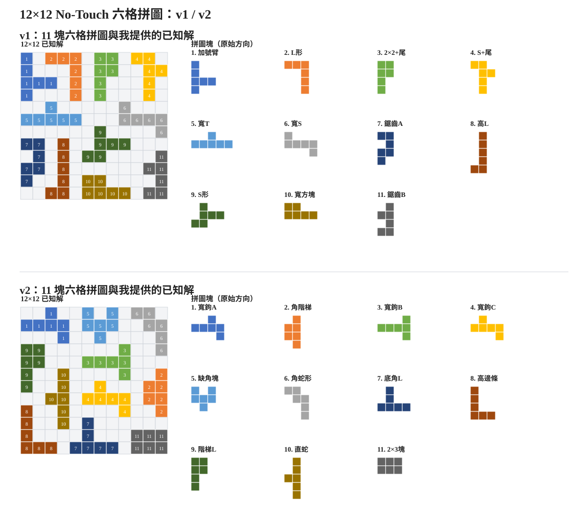
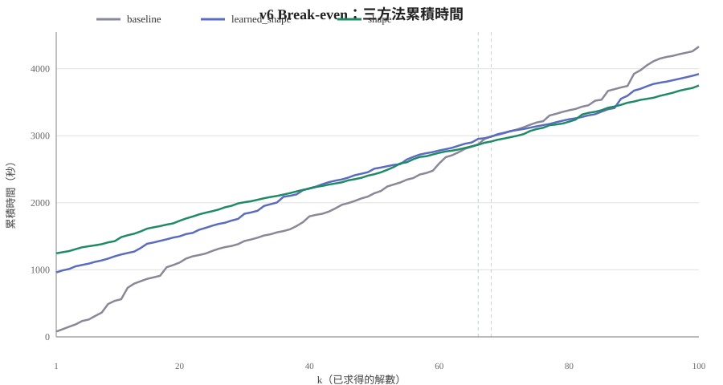
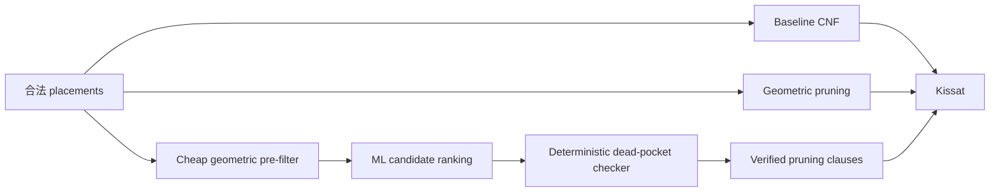

# Learning-Guided Dead-Pocket Pruning for SAT-Based Puzzle Solving

我以 12×12 no-touch 六格拼圖為案例，研究如何用**幾何 dead-pocket 剪枝**與
**learning-guided candidate ranking**改善 SAT-based puzzle solving。

> This project extends my previous SAT encoding work on Untouchable 11 by studying
> geometric and learning-guided pruning for new 12×12 no-touch puzzle instances.

## 與大三上專題的關係

我的[大三上專題 `untouchable11-sat`](https://github.com/Michaelwu128/untouchable11-sat)
將 Untouchable 11 形式化為 SAT/CNF，比較 placement-only、cell-variable channeling
與 Sequential Counter 等 Model A / B / C encoding。這個大三下專題沿用 SAT-based
puzzle solving 的基礎，研究焦點則從「如何縮小 encoding」轉向「如何用幾何與學習式方法提早剪除無效搜尋分支」。

## Highlights

- **SAT-based puzzle solving**：將 11 塊六格拼圖的合法放置、no-touch 與對稱限制編碼為 CNF，交由 Kissat 求解。
- **Geometric dead-pocket pruning**：以 deterministic geometric checker 找出無法容納剩餘拼圖塊的小空腔，加入通過 checker 驗證的 pruning clauses。
- **Learning-guided ranking**：以便宜的幾何預篩與 LightGBM LambdaRank 排序候選；ML 不直接決定 SAT constraint。
- **End-to-end evaluation**：同時量測 CNF preprocessing 與求解／多解枚舉，結果顯示 geometric pruning 與 learned 方法各有適用情境，沒有單一方法全面勝出。

## 問題與動機

每題有 11 塊六格拼圖，所有拼圖塊都要放入 12×12 棋盤；不同拼圖塊之間不能重疊，
也不能在水平、垂直或對角方向接觸。我的 baseline 為每個合法 placement 建立布林變數，
再用 Kissat 求解 CNF。這個表示法方便表達 placement 間的幾何關係，但會產生數千萬條
pairwise conflict clauses；全面掃描 dead pocket 又會增加昂貴的 preprocessing。

> 能否在不加入錯誤剪枝子句的前提下，減少昂貴的 dead-pocket 檢查，
> 並改善從 CNF 建構到多解枚舉的端到端時間？



## ML 與 geometric oracle 如何分工

ML 在這裡只負責 **ranking / pre-screening**：它預測哪些 placement pairs
較值得優先檢查，但不直接產生 SAT pruning constraint。候選 pair 必須通過 deterministic
geometric dead-pocket checker `has_dead_pocket`，確認確實會留下無法容納六格拼圖塊的小空腔，
才會加入 `¬pi ∨ ¬pj`。

- ML false positive 會被 checker 擋下，不會直接變成 pruning clause。
- ML false negative 只會漏掉可能的剪枝機會，不會因 ML 本身加入錯誤 constraint。
- 這是 soundness-preserving design，但正確性仍依賴 `has_dead_pocket`
  對幾何條件的實作是否正確；本專案不是 proof-assistant 或 machine-checked proof。

## 主要結果

以下三組結果來自不同評估協議，不能互相當成同一組排名：

| 實驗 | 結果 | 研究意義 |
|---|---|---|
| [v2 geometric pruning](EXPERIMENT_RESULTS.md) | D4-blocked 5 解平均 Kissat：baseline **12.778 s** → shape″ **6.674 s**；但 shape″ `build_cnf` 為 **3359.8 s（約 56 分鐘）** | pruning 可縮短 SAT solving time，但 preprocessing cost 很高 |
| [v4 learned hold-out](baselines/learned_shape/REPORT.md) | learned **21.4 s**、baseline **47.0 s**、full shape **24.1 s**（D4 + 10 seeds） | learning-guided pruning 在這個 hold-out workload 有效，但不是所有拼圖都如此 |
| [v6 連續枚舉 100 解](baselines/v6/break_even/RESULTS.md) | 含一次 CNF build：shape **3749 s**、learned **3920 s**、baseline **4330 s** | 長枚舉時 geometric shape 最佳，沒有單一方法全面勝出 |



v2 表中的 baseline / shape / shape′ 為 2026-06-04 重跑（Kissat 預設 seed=0），
shape″ 沿用 2026-06-03 的五次結果；此限制已記錄在來源文件。

## 方法與 pipeline



- **Geometric shape variants**：直接檢查一至三個 placements 是否形成小於六格的 4-連通空腔。
- **Learned path**：使用 78 維 puzzle-invariant 特徵排序 placement pairs，
  再由同一 geometric checker 確認。
- **共同 baseline**：所有主要比較沿用 placement-variable encoding，讓差異集中在 pruning；
  它不是最精簡的 CNF encoding。

## 快速開始

需求：Python 3.10+、[Kissat](https://github.com/arminbiere/kissat)，以及
[`requirements.txt`](requirements.txt) 中的 ML 套件。

```bash
git clone https://github.com/Michaelwu128/new_puzzle_2026.git
cd new_puzzle_2026
python3 -m venv .venv
source .venv/bin/activate
pip install -r requirements.txt

# 若 kissat 已在 PATH，不需額外設定；也可指定：
export KISSAT=/path/to/kissat

cd encoding
python3 generate_cnf.py --puzzle v2 --method shape --out cnf/v2/shape.cnf
python3 run_enum_benchmark.py --puzzle v2 --count 5 --methods baseline shape
```

ML 模型檔屬大型生成物，不直接納入 Git；可依
[`baselines/learned_shape/EXPERIMENTS_DETAILED.md`](baselines/learned_shape/EXPERIMENTS_DETAILED.md)
的資料建置與訓練指令重建。大型 oracle 標記、placement metadata 與 v6 解答見
[`ARTIFACTS.md`](ARTIFACTS.md)。

## 詳細實驗與文件

| 你想知道… | 先讀這份 |
|-----------|----------|
| 整體方法、v1/v2 geometric pruning 實驗、公平枚舉 | [`EXPERIMENT_RESULTS.md`](EXPERIMENT_RESULTS.md) |
| ML、L0、hold-out 與整體結論 | [`baselines/learned_shape/REPORT.md`](baselines/learned_shape/REPORT.md) |
| 資料、訓練、參數、seeds 與重現步驟 | [`baselines/learned_shape/EXPERIMENTS_DETAILED.md`](baselines/learned_shape/EXPERIMENTS_DETAILED.md) |
| v6 連續枚舉與 break-even | [`baselines/v6/break_even/RESULTS.md`](baselines/v6/break_even/RESULTS.md) |

三次專題階段簡報收錄於 [`slides/`](slides/)。

## 目錄結構（精簡）

```
new_puzzle_2026/
├── README.md                 ← 本文件
├── EXPERIMENT_RESULTS.md     ← Geometric pruning 實驗總整理
├── encoding/                 ← CNF 生成、剪枝、benchmark 腳本
│   ├── generate_cnf.py
│   ├── learned_shape.py
│   ├── run_enum_benchmark.py
│   ├── run_break_even_benchmark.py
│   ├── run_v4_l0_benchmark.py
│   └── …
├── baselines/
│   ├── learned_shape/        ← ML 報告與實驗設定
│   └── v1/ v2/ … v6/        ← 各拼圖結果
├── docs/images/              ← README 靜態圖
├── slides/                   ← 三次專題簡報
└── tools/
    └── render_puzzle_overview.py
```

## 可重現性與限制

- benchmark configuration、solver settings、seeds 與命令保留在上述詳細文件；跨表格結果若協議不同，不做直接排名。
- learned 方法的效果依 hold-out puzzle 與 oracle budget 而變；目前結果不足以宣稱全面優於 baseline 或 exhaustive geometric pruning。
- `generate_cnf.py` 的 baseline 直接對衝突 placements 產生二元子句，且未去除重複子句。這讓 pruning
  實驗共用同一基準，但不是最精簡的 encoding。
- 前作的 Model C 使用 cell variables、channeling 與 Sequential Counter。未來工作是將它移植到相同
  v1–v6 instances，再公平比較 CNF build、Kissat 與 break-even；本專案尚未做這項同實例比較。
- 大型 CNF、模型、完整 oracle labels、placement metadata 與逐解 SAT assignments 不直接納入 Git；
  下載位置、checksum 與重建方式見 [`ARTIFACTS.md`](ARTIFACTS.md)。

<details>
<summary>實驗文件中的內部術語</summary>

- **v1–v6**：六組 12×12 拼圖定義，位於 `encoding/puzzle_defs.py`。
- **v123 / v12345**：分別以 v1–v3／v1–v5 合併訓練的 ranker；評估拼圖不加入訓練集。
- **L0@25%**：以低成本幾何 cascade 預篩後，將全部候選的 top 25% 送入 oracle。
- **Split-B**：早期 Random Forest 實驗的 v1+v2 80/20 random split；不是目前的 LightGBM ranker。
- **sweep k\***：達到指定 clause recall 的最小 top-K%；**break-even k\***：
  `CNF build + 前 k 次 Kissat` 首次低於 baseline 的解數。

</details>
