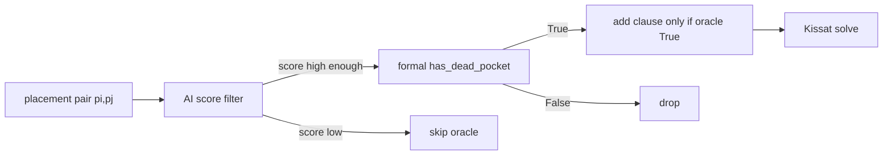
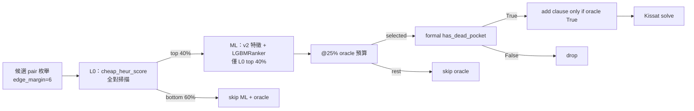
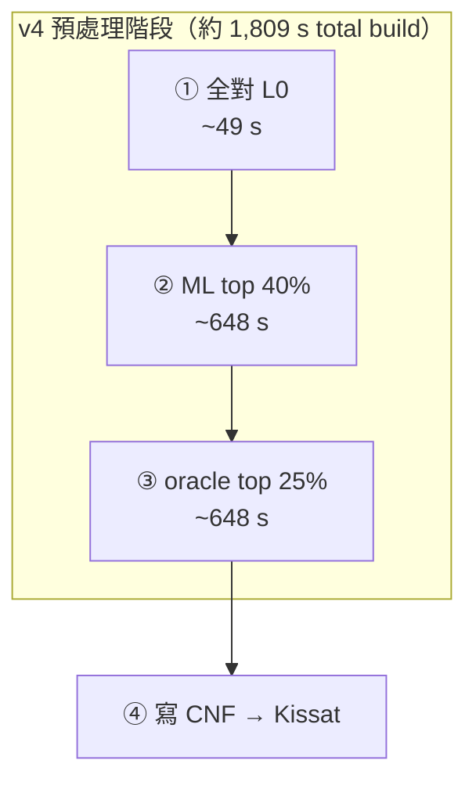

# Learned Dead-Pocket 實驗詳解

> **專案**：`learned-dead-pocket-sat`  
> **方法**：AI 預篩 placement pair → formal `has_dead_pocket` oracle 閘門 → 僅確認後加子句  
> **簡版報告**：[REPORT.md](./REPORT.md)  
> **最後更新**：2026-06-18（含 v123 無 L0 @25%/@50% CNF、v6 break-even k=100）  

---

## 目錄

1. [背景與 Soundness](#1-背景與-soundness)
2. [附錄：50/25/25 分層抽樣](#2-附錄5025--25-分層抽樣是什麼)
3. [實驗一：資料集建構](#3-實驗一資料集建構)
4. [實驗二：ML 模型訓練](#4-實驗二ml-模型訓練)
5. [實驗三：Phase 1 — Oracle 效率曲線](#5-實驗三phase-1--oracle-效率曲線)
6. [實驗四：Phase 2 — SAT 求解](#6-實驗四phase-2--sat-求解)
7. [實驗五：General-Purpose Ranker（LOO）](#7-實驗五general-purpose-rankerloo)
8. [實驗六：v4 Zero-Shot + L0 Cascade](#8-實驗六v4-zero-shot--l0-cascade)
9. [實驗七–九：hold-out 矩陣（v4/v5/v6）](#9-實驗七九v4-cascade--v5--v6-hold-out-矩陣)
10. [實驗十：v12345 → v6](#10-v12345-合訓--v6-hold-out)
11. [實驗十一：v6 break-even](#11-實驗十一v6-break-even-連續枚舉)
12. [實驗總覽表](#12-實驗總覽表)
13. [重現指令](#13-重現指令)
14. [相關檔案](#14-相關檔案)

---

## 1. 背景與 Soundness

### 問題

Formal shape 剪枝（dead-pocket）有效，但 **全掃 placement pair** 很慢：

| 拼圖 | full formal CNF 生成 | 新增二元子句 |
|------|----------------------|--------------|
| v1 | ~19 min | +188 萬 |
| v2 | ~12 min | +147 萬 |

### 做法

**基礎版（無 L0）**——訓練資料標註與 sweep「上限」路徑：



**部署版（L0 Cascade + @25%）**——`run_v4_l0_benchmark.py` / `generate_cnf(method=learned_shape)` 實際路徑：



L0 用 bbox / exclusion / 近邊等極便宜特徵打分（**不跑** v2 grid histogram）；僅 `cascade_l0_frac`（預設 **0.4**）存活對進 ML。  
環境變數：`LEARNED_SHAPE_CASCADE_L0`、`LEARNED_SHAPE_TOP_K`（見 `learned_shape.score_candidate_pairs()`）。

### Soundness 保證

| AI 錯誤類型 | 後果 | 是否 UNSOUND |
|-------------|------|--------------|
| **假陽性**（預測會 dead，實際不會） | oracle 回 False，**不加子句** | 否 |
| **假陰性**（預測不會 dead，實際會） | **漏加** `¬pi∨¬pj`，剪枝變弱 | 否（SAT 仍 correct） |

AI **從不直接加子句**；oracle 是最終閘門。

---

## 2. 附錄：50% / 25% / 25% 分層抽樣是什麼？

這是**計畫書中設計的資料集抽樣策略**，目的是在「不能全掃千萬對 pair」時，仍讓訓練資料**覆蓋不同幾何情境**。

### 三個 bucket 的定義

程式碼中 `dead_pocket_pairs.stratify_bucket()` 的定義如下（優先順序由上到下）：

| Bucket | 中文 | 判定條件 | 直覺 |
|--------|------|----------|------|
| **near_edge** | 近邊 | 任一方塊有格子落在 **margin ≤ 4** 的邊帶內 | 貼邊放置較易產生死腔；formal shape 也優先查邊角 |
| **band_overlap** | 行列帶重疊 | 兩塊 bbox 在 **row 或 col 方向有重疊**（且非 near_edge） | 同一行帶/列帶的 pair，幾何交互較複雜 |
| **random** | 其餘隨機 | 以上皆非 | 一般內部 pair |

示意（12×12 棋盤）：

```
margin=4 邊帶：
┌────────────────┐
│ near_edge 區   │
│  ┌──────────┐  │
│  │ 內部     │  │  ← random / band_overlap
│  └──────────┘  │
│                │
└────────────────┘

band_overlap 例：兩塊 bbox 行範圍 [2,4] 與 [3,5] 重疊
```

### 50% / 25% / 25% 的意思

若目標抽樣 **N 對**，則：

- **50%（N/2）** 從 **random** bucket 均勻抽
- **25%（N/4）** 從 **near_edge** bucket 抽（確保邊角案例足夠）
- **25%（N/4）** 從 **band_overlap** bucket 抽（確保同行/同列帶案例足夠）

**為什麼要這樣分？**

1. 若純隨機抽，near_edge / band_overlap 在全体中比例可能偏低，模型對「邊角死腔」學不好。
2. Dead-pocket 在 formal 剪枝裡本來就與**邊緣幾何**高度相關。
3. 分層可確保少數但重要的幾何類型不被 random 淹沒。

**額外規則（計畫書）**：無論怎麼抽，**所有 label=1（dead pocket）的 pair 盡量全保留**，因 positive 太稀疏。

### ✅ 實際實作（2026-06-16 Ranker 計畫）

| 項目 | 計畫 | 實際 `build_dead_pocket_dataset.py --features v2` |
|------|------|-----------------------------------------------------|
| 抽樣方式 | 50/25/25 分層 | ✅ 三 bucket + **fallback**（桶滿轉其他桶） |
| `stratify_bucket()` | 接入 | ✅ 已接入 |
| 正樣本 | 全保留 | ✅ 掃描期間全保留（可早停於 neg=400k） |
| 負樣本 | 400k 分層 | ✅ random 200k + near_edge 100k + band_overlap 100k |

輸出：`dataset_{v1,v2}_v2.csv`、`dataset_meta_v2.json`。

---

## 3. 實驗一：資料集建構

**腳本**：`encoding/build_dead_pocket_dataset.py`  
**目的**：自動產生 `(features, label)`，label 由 formal oracle 標註，無需人工。

### 3.1 一筆資料是什麼？

每一列 = 一個 **placement pair** `(plc_a, plc_b)`：

- 來自**不同 piece** 的兩個合法放置
- **不直接衝突**（B 的格子不在 A 的 exclusion zone）
- 至少一塊在 **edge_margin=6** 邊帶內（與 shape′ 一致）

**Label**：

- `1` = `has_dead_pocket(A, B)` 為 True（同放後出現 < 6 格孤立空區）
- `0` = 否

### 3.2 候選 pair 枚舉

`dead_pocket_pairs.iter_candidate_pairs()`：

```
for piece i < j:
  for plc_a in placements[i]:
    for plc_b in placements[j]:
      if 跨 piece and 不衝突 and 近邊(margin=6):
        yield (plc_a, plc_b)
```

| 拼圖 | placements | 候選 pair 總數（Phase 1 實測） |
|------|------------|-------------------------------|
| v1 | 7,464 | 16,726,136 |
| v2 | 6,120 | 11,085,192 |

### 3.3 Formal Oracle（標籤來源）

`generate_cnf.has_dead_pocket(cells_a, cells_b, 12, 12)`：

1. 合併兩塊 exclusion zone → forbidden 格
2. 剩餘 free 格做 **4-連通 BFS**
3. 若存在 **0 < 連通分量大小 < 6** → True

與 shape′ 剪枝定義相同。

### 3.4 特徵（33 維，不跑 BFS）

`dead_pocket_features.extract_pair_features()` — 推理階段用，必須便宜：

| 類別 | 欄位 | 說明 |
|------|------|------|
| Piece | `piece_a`, `piece_b`, `piece_dist` | 哪兩塊 |
| Bbox | `bbox_h/w_a/b`, `area_a/b`, `center_r/c_a/b` | 形狀與位置 |
| 邊距 | `min/max/mean_edge_dist_a/b` | 到四邊距離 |
| 相對幾何 | `row/col_overlap`, `row/col_gap` | 是否同行列帶 |
| Exclusion | `exc_overlap_count` | 兩 exclusion 重疊格數 |
| 空間粗估 | `free_proxy` | `144 − |exc_a| − |exc_b| + overlap` |
| 邊緣 flag | `near_edge_*` (margin 6), `near_margin4_*` | 對照 formal 篩選 |

CSV 欄位：`33 特徵 + label + var_a + var_b + puzzle`

### 3.5 抽樣策略（實際實作）

**Reservoir sampling**（分 pos / neg 兩個水庫）：

```python
for each candidate pair:
  label = has_dead_pocket(...)
  features = extract_pair_features(...)
  if label == 1:
    pos_reservoir.add(row)   # 上限 max_pos_samples
  else:
    neg_reservoir.add(row)   # 上限 max_neg_samples
  if neg 滿 and pos 足夠 → 早停
```

預設：`max_neg_samples=500_000`，`max_pos_samples=100_000`

### 3.6 產出數字

#### v1 — `dataset_v1.csv`（與 `dataset_meta.json` 一致）

| 項目 | 值 |
|------|-----|
| 掃描 pair | 472,588 |
| positive rate | **15.4%** |
| 寫入列數 | 472,588 |
| 組成 | 72,588 pos（全留）+ 400,000 neg |
| 建置時間 | ~61 s |

#### v2 — 兩階段

**Meta 記錄的小样本 run**（467,649 列，pos rate 14.5%）：

| 項目 | 值 |
|------|-----|
| 組成 | 67,649 pos + 400,000 neg |

**目前磁碟上的 `dataset_v2.csv`（訓練實際使用）**：

| 項目 | 值 |
|------|-----|
| 總列數 | 1,598,160 |
| positive | 1,473,160（**92.2%**） |
| negative | 125,000 |
| 解讀 | 幾乎保留 **全部 dead pair**（與 full formal 1,473,160 一致）+ 少量 neg reservoir |

⚠️ v2 資料嚴重不平衡，解讀 Split-A（v1→v2）時須注意 test set 的 positive rate 遠高於真實 ~14%。

### 3.7 實驗一的小結

1. Dead pocket 自然 positive rate 約 **14–15%**
2. Full formal 的 dead pair 數量極大（v2：**147 萬**）
3. 特徵設計刻意**不含 BFS**，把代價留給 oracle
4. 計畫的分層抽樣尚未接入；實際用 reservoir

---

## 4. 實驗二：ML 模型訓練

**腳本**：`encoding/train_dead_pocket_model.py`  
**目的**：訓練「哪些 pair 較可能 dead pocket」的 **ranking 模型**（部署用 top-K%，非單純 0.5 threshold）。

### 4.1 模型與設定

| 項目 | 值 |
|------|-----|
| 演算法 | `RandomForestClassifier` |
| 樹數 / 深度 | n_estimators=120, max_depth=14 |
| 不平衡 | `class_weight='balanced'` + sample_weight |
| 部署預設 | **`model_splitB.joblib`** |

### 4.2 兩種資料切分

#### Split-A：跨拼圖泛化

| | 內容 |
|---|------|
| **Train** | v1 子樣本（最多 25 萬列） |
| **Test** | v2 **全量** CSV |
| **問題** | 在 v1 上學到的規則，能否遷移到 v2？ |

| 指標 | Train | Test (v2) |
|------|-------|-----------|
| Recall | 1.000 | **0.696** |
| Precision | 0.693 | 0.973 |
| ROC-AUC | 0.995 | 0.800 |
| **Recall@10%** | 0.641 | **0.107** |

**解讀**：跨拼圖泛化弱；top-10% 在 v2 只能 cover **10.7%** 的 dead pocket。

#### Split-B：混合 80/20

| | 內容 |
|---|------|
| **Train** | v1+v2 混合，80%（最多 25 萬列） |
| **Test** | 剩餘 20% random |
| **問題** | 同分布下 ML 能學多好？ |

| 指標 | Train | Test |
|------|-------|------|
| Recall | 0.939 | **0.938** |
| Precision | 0.990 | 0.989 |
| ROC-AUC | 0.992 | 0.990 |
| **Recall@10%** | 0.134 | **0.134** |

**解讀**：同分布下 precision ~99%、recall ~94%；但 **Recall@10% 只有 13.4%** — 因 positive 極稀疏，小 K 不可能 cover 大部分 dead pocket。

### 4.3 為什麼看 Recall@top-K%？

部署時不是「score > 0.5 就 oracle」，而是：

> 對全部 pair 打分 → 取 **top K%** → 只對這些呼叫 oracle

因此 **Recall@10%** = 「只 oracle 10% pair 時，能找回多少 % 的 dead pocket」— 這才是 Phase 1 sweep 的直接指標。

### 4.4 產出

| 檔案 | 內容 |
|------|------|
| `model_splitA.joblib` | Split-A 模型 |
| `model_splitB.joblib` | Split-B 模型（**部署預設**） |
| `training_report.json` | 完整 metrics + `feature_names` |

---

## 5. 實驗三：Phase 1 — Oracle 效率曲線

**腳本**：`encoding/run_learned_shape_benchmark.py --phase sweep`  
**目的**：量 **top-K% 與 oracle 呼叫數 / 子句 recall / 時間** 的 trade-off。  
**不寫完整 CNF**，只跑子句生成邏輯。

### 5.1 流程

1. 載入或建立 **full dead-pair 集合**（`full_dead_{puzzle}.json` 快取）
2. 對 K ∈ {1, 5, 10, 25, 50, 100}：
   - 全部 pair ML 打分 → 取 top K%
   - 只對選中 pair 呼叫 `has_dead_pocket`
   - 計算 **clause_recall_vs_full** = 找回的 dead pair / full 集合

### 5.2 v2 結果（11,085,192 候選對）

Full formal：1,473,160 dead pairs，首次掃描 ~945 s

| top-K | Oracle 比例 | Clause recall | Oracle 秒 | 總秒 |
|-------|-------------|---------------|-----------|------|
| 1% | 1% | 7.4% | 8.6 | 302 |
| 5% | 5% | 34.4% | 50.7 | 320 |
| 10% | 10% | 62.2% | 100.2 | 382 |
| 25% | 25% | 96.5% | 227.1 | 501 |
| **50%** | **50%** | **99.8%** | **491.7** | **778** |
| 100% | 100% | 100% | 962.9 | 1,250 |

**K\* = 50%**（最小 K 使 recall ≥ 99%）

### 5.3 v1 結果（16,726,136 候選對）

Full formal：1,881,352 dead pairs

| top-K | Oracle 比例 | Clause recall | Oracle 秒 |
|-------|-------------|---------------|-----------|
| 25% | 25% | 84.5% | 337.0 |
| 50% | 50% | **97.8%** | 780.1 |
| **100%** | 100% | **100%** | 1,467.3 |

**K\* = 100%**（50% 未達 99% 門檻）

### 5.4 關鍵觀察

1. **Oracle BFS 可減半**（v2 @50%：492 s vs 963 s @100%）
2. **ML 推理成本固定**：仍須對全部 pair 算 33 維特徵 + `predict_proba`（v2 ~1100 萬對），故「總秒」不隨 K 線性降
3. **Positive 稀疏 → 要 high recall 需大 K**：與實驗二 Recall@10%=13.4% 一致

### 5.5 產出

- `sweep_v1.json`、`sweep_v2.json`
- `full_dead_v1.json`、`full_dead_v2.json`

---

## 6. 實驗四：Phase 2 — SAT 求解

**腳本**：`encoding/run_learned_shape_benchmark.py --phase sat`  
**目的**：learned 剪枝在**實際解題**上是否接近 full shape。

### 6.1 實驗設計

與 [`d4_next_sol_seeds/SUMMARY.md`](../d4_next_sol_seeds/SUMMARY.md) 相同：

| 項目 | 設定 |
|------|------|
| 封鎖 | 已知解 **D4 對稱**（8 條 blocking） |
| 求解 | Kissat seed 1–10，各找 1 個新 SAT 解 |
| 驗證 | no-touch；D4 互異解統計 |

選定 K\*：

- **v2**：50%（recall 99.8%）+ 100%（對照）
- **v1**：100%（50% 只有 97.8% recall）

### 6.2 v2 結果

| 方法 | 求解平均 | vs baseline | CNF 生成 (s) | Clause recall |
|------|----------|-------------|--------------|---------------|
| baseline | 11.35 s | 1.00× | 21.9 | — |
| shape / shape′ | **6.63 s** | **1.71×** | ~724 | 100% |
| learned @50% | 11.99 s | 0.95× | 764 | 99.8% |
| learned @100% | 16.50 s | 0.69× | 1,315 | 100% |

- 10/10 SAT、valid、D4 互異 10/10 ✅
- @50% 漏 0.2% 子句 → 求解接近 baseline，遠慢於 shape
- @100% 子句數與 shape 相同，求解仍較慢（可能與子句順序 / CNF 結構有關）

### 6.3 v1 結果

| 方法 | 求解平均 | vs baseline | CNF 生成 (s) |
|------|----------|-------------|--------------|
| baseline | 27.88 s | 1.00× | 35.8 |
| shape / shape′ | **12.66 s** | **2.20×** | ~1,128 |
| learned @100% | **20.06 s** | **1.39×** | 1,867 |

- 10/10 SAT、valid、D4 互異 10/10 ✅
- 比 baseline 快，但仍慢於 full shape
- CNF 生成比 full shape 更慢（多了 ML 推理）

### 6.4 產出

- `baselines/v2/learned_shape/`：`learned_shape_k50_*`、`learned_shape_k100_*`、`results.json`
- `baselines/v1/learned_shape/`：`learned_shape_k100_*`、`results.json`

---

## 7. 實驗五：General-Purpose Ranker（LOO）

**腳本**：`train_dead_pocket_ranker.py`、`run_learned_shape_benchmark.py --loo`  
**目的**：puzzle-invariant v2 特徵 + LightGBM lambdarank，leave-one-out 驗證跨拼圖 @25% oracle budget。

### 7.1 v2 特徵（`dead_pocket_features_v2.py`）

- **移除**：`piece_a`, `piece_b`, `piece_dist`（拼圖專用 ID）
- **保留強化**：bbox、edge_dist、overlap/gap、free_proxy、`near_margin4_*`
- **新增**：shape signature（canonical 6 格）、relative placement（Δcenter、IoU、band overlap）、4×4 grid histogram、`heur_score`

### 7.2 Ranker 訓練

- 模型：LightGBM `LGBMRanker`（query group ≤5000 rows）
- 混合分數：`0.7 × ML + 0.3 × heur_score`（normalized）
- Early stopping：eval fold Recall@25% callback

| LOO | Eval Recall@25% | Eval AUC | 模型檔 |
|-----|-----------------|----------|--------|
| v1→v2 | 26.9% | 0.559 | `ranker_loo_v1_train.joblib` |
| v2→v1 | 36.2% | 0.628 | `ranker_loo_v2_train.joblib` |

### 7.3 LOO Sweep（clause recall）

| Eval | @25% | @50% | K\* (≥99%) |
|------|------|------|------------|
| v2 (train v1) | 38.2% | 65.7% | **100%** |
| v1 (train v2) | 54.3% | 78.4% | **100%** |

對照同拼圖 Split-B RF：v2 @25% 為 **96.5%** — LOO 跨拼圖差距巨大。

### 7.4 LOO SAT

| Eval | @25% SAT | baseline | shape | 達 P0? |
|------|----------|----------|-------|--------|
| v2 | 14.41 s | 11.35 s | 6.63 s | ❌ |
| v2 @100% | 9.69 s | 11.35 s | 6.63 s | 部分（快於 baseline，仍慢 shape） |
| v1 @25% | 20.36 s | 27.88 s | 12.66 s | ❌（clause recall 不足） |
| v1 @50% | 18.03 s | 27.88 s | 12.66 s | ❌ |

### 7.5 工程改進

- `write_cnf()`：**canonical clause sort**（消除 Kissat order effect）
- `phase_sweep()`：一次打分、多 K oracle（避免 6× 重算特徵）
- `generate_cnf.py`：預設 `DEAD_POCKET_FEATURES=v2`、ranker 模型路徑
- **L0 cascade**（2026-06-16）：`cheap_heur_score()` 預篩 → 僅 top `cascade_l0_frac` pairs 跑完整 ML；`LEARNED_SHAPE_CASCADE_L0` 環境變數 / `--cascade-l0`

---

## 8. 實驗六：v4 Zero-Shot + L0 Cascade

**日期**：2026-06-16  
**拼圖**：v4（hold-out，形狀與已知解見 `encoding/puzzle_defs.py`）
**腳本**：`run_learned_shape_benchmark.py`（sweep）、`run_v4_l0_benchmark.py`（端到端）

### 8.1 動機

1. v3/v4 擴充訓練資料，測 **跨拼圖 zero-shot** 是否改善 @25% recall。
2. **L0 cascade** 降低 ML 特徵成本（不必對 1420 萬 pairs 全跑 v2 特徵）。
3. 在 v4 上直接對照：**預處理時間 vs full shape**、**SAT vs baseline / shape**。

### 8.2 資料與模型

| 項目 | 內容 |
|------|------|
| v3/v4 資料集 | `dataset_v3_v2.csv`、`dataset_v4_v2.csv`（各 ~44 萬 rows，neg 早停 400k） |
| 合訓 ranker | `ranker_train_v1_v2_v3.joblib`（eval v4 Recall@25% = 42.6%） |
| v4 sweep 最佳單模型 | `ranker_loo_v2_train.joblib`（@25% clause recall **47.0%**） |
| full dead 快取 | `full_dead_v4.json`（1,630,496 pairs） |

### 8.3 Zero-Shot Sweep（Phase 1，無 L0）

候選對總數 **14,196,664**；`clause_recall_vs_full` 相對 full shape dead set。

| 訓練 | @1% | @5% | @10% | **@25%** | @50% |
|------|-----|-----|------|----------|------|
| v1→v4 | 0.7% | 9.0% | 17.2% | **39.6%** | 63.7% |
| v2→v4 | 1.9% | 9.7% | 21.1% | **47.0%** | 68.7% |
| v1+v2+v3→v4 | 5.1% | 19.8% | 28.1% | **42.1%** | **70.7%** |

**觀察**：v2-only @25% 最佳；合訓在 @50% 與低 K 較強。P0（@25% ≥ 99%）仍遠未達。

### 8.4 L0 Cascade 機制

與 [§1 部署版 Pipeline](#1-背景與-soundness) 相同；v4 實測各階段耗時（@25% 部署）：



| 階段 | 輸入 | 輸出 | v4 約略耗時 |
|------|------|------|-------------|
| L0 | 全部候選對 | 保留 top **40%** | ~49 s |
| ML | L0 存活對 | 全對排序（未存活 = −∞） | ~648 s |
| @25% + oracle | top 25% **of all pairs** | 確認 dead → 加子句 | ~648 s |

實作：`learned_shape.score_candidate_pairs(cascade_l0_frac=0.4)`；CNF 路徑經 `LEARNED_SHAPE_CASCADE_L0=0.4`。

### 8.5 端到端 Benchmark（`run_v4_l0_benchmark.py --all`）

**設定**：v2 ranker、`top_k=25%`、`cascade_l0=0.4`、D4 封鎖 + Kissat seed 1..10。

#### 預處理

| 方法 | CNF build (s) | 總 CNF (s) | base 子句數 | 新增 dead 子句 |
|------|---------------|------------|-------------|----------------|
| baseline | 37 | 184 | 54,876,183 | 0 |
| shape | 2,437 | 2,610 | 56,506,679 | +1,630,496 |
| learned L0@25% | **1,809** | **1,972** | 55,480,448 | +604,265 |

Learned 預處理比 shape **快 1.35×**（省 ~628 s）。

#### SAT 求解

| 方法 | 平均 (s) | 中位數約 | vs baseline | vs shape |
|------|----------|----------|-------------|----------|
| baseline | 46.97 | ~36 | 1.00× | — |
| shape | 24.11 | ~20 | 1.95× | 1.00× |
| learned L0@25% | **21.40** | ~15 | **2.20×** | **1.13×** |

各方法 10/10 SAT、no-touch valid。

### 8.6 解讀與限制

**正面**（v4 hold-out）：

- L0 + @25% 同時達成 **更短預處理** 與 **更快 SAT**（甚至略優 full shape）。
- 證明 cascade 可實際砍掉 ML 成本，且 partial 子句集在 v4 上仍有效剪枝。

**限制**：

- 子句僅 **~37%** full shape 覆蓋率（604k / 1.63M）；recall 不足時公式更弱，SAT 變快不一定可推廣。
- 僅 **一個拼圖 v4**；v1/v2 LOO @25% 仍無法取代 shape。
- 預處理 **~30 min** 仍遠慢於 baseline **37 s**。
- CNF 產生 log 中 `recall=1.000` 為 **未載入 full_dead 對照** 的 placeholder，勿與 sweep 的 47% 混淆。

### 8.7 產出

| 路徑 | 內容 |
|------|------|
| `baselines/v4/l0_benchmark/v4_l0_benchmark.json` | 完整 JSON（preprocess + SAT per-seed） |
| `baselines/v4/l0_benchmark/v4_l0_benchmark_v123.json` | v123 L0@25% 端到端 |
| `baselines/v4/l0_benchmark/v4_v123_no_l0_k25.json` | v123 無 L0 @25%（CNF+SAT，2026-06-18） |
| `baselines/v4/l0_benchmark/v4_v123_no_l0_k50.json` | v123 無 L0 @50%（CNF only，2026-06-18） |
| `baselines/v4/l0_benchmark/v4_v123_l0_k50.json` | v123 L0@50%（CNF only，2026-06-18） |
| `baselines/v4/l0_benchmark/cnf_manifest.json` | CNF 耗時與子句數 |
| `baselines/v4/l0_benchmark/run.log` | 執行 log |
| `encoding/run_v4_l0_benchmark.py` | 編排腳本（含 `--no-l0`） |
| `encoding/run_v4_v123_no_l0_chain.sh` | v123 無 L0 一鍵補跑 |

### 8.8 重現

```bash
cd encoding

# Zero-shot sweep（可選 L0）
python3 run_learned_shape_benchmark.py --phase sweep \
  --train-puzzle v2 --eval-puzzle v4 --features v2
python3 run_learned_shape_benchmark.py --phase sweep \
  --train-puzzle v2 --eval-puzzle v4 --features v2 --cascade-l0 0.4

# 合訓 + v4 eval
python3 build_dead_pocket_dataset.py --puzzle v3 v4 --features v2
python3 train_dead_pocket_ranker.py --train-puzzle v1 v2 v3 --eval-puzzle v4 --features v2

# v4 端到端（預處理 + SAT）
python3 run_v4_l0_benchmark.py --all
```

### 8.9 v123 CNF build 補跑（無 L0 + L0@50%，2026-06-18）

**動機**：sweep 已有 recall，簡報表一需補 **實際 CNF build**；無 L0 @25% 另跑 SAT。  
**腳本**：`run_v4_l0_benchmark.py --no-l0` 或 `--cascade-l0 0.4`；無 L0 一鍵 `run_v4_v123_no_l0_chain.sh`。

**模型**：`ranker_train_v1_v2_v3.joblib` | **拼圖**：v4 hold-out | **run_at**：2026-06-18

#### CNF build 與子句（shape build = 2,437 s 為對照）

| 模式 | top-K | L0 | sweep recall | CNF build (s) | 額外 dead 子句 | vs shape |
|------|-------|-----|-------------|---------------|----------------|----------|
| v123 無 L0 | 25% | — | 42.1% | **1,195.5** | +687,057 | **2.04× 快** |
| v123 無 L0 | 50% | — | 70.7% | **1,761.3** | +1,152,910 | **1.38× 快** |
| v123 L0 | 25% | 0.4 | 34.7% | **999.2** | +566,171 | **2.44× 快** |
| v123 L0 | 50% | 0.4 | 53.3% | **1,233.3** | +869,762 | **1.98× 快** |
| shape | — | — | 100% | 2,436.8 | +1,630,496 | 1.00× |

候選對 **14,196,664**。L0@50% 階段：`l0≈30 s`、`ml≈416 s`、`oracle≈590 s`（7,098,332 calls，50.0%）。無 L0 @50% `oracle≈659 s`。

#### SAT（僅 @25% 無 L0；D4 + Kissat seed 1..10）

| 方法 | mean (s) | vs baseline (47.0 s) | vs shape (24.1 s) |
|------|----------|----------------------|-------------------|
| v123 無 L0 @25% | **28.31** | 1.66× | 0.85×（慢） |
| v123 L0@25%（對照） | 28.11 | 1.67× | 0.86×（慢） |

10/10 SAT、valid ✅。無 L0 與 L0@25% SAT **幾乎相同**；L0 主要節省 build。

#### 解讀

- 四種 learned CNF **皆快於 shape**；選 @25% 部署是因 **oracle 預算 + SAT KPI**，非因 @50% build 輸 shape。
- **L0@50%** 比無 L0 @50% 省 **~528 s** build，子句較少（53% vs 71% full shape recall）。
- @50% 變體僅 `--cnf-only`，未跑 SAT。
- CNF log 中 `recall=1.000` 為 placeholder；clause recall 以 sweep 為準。

#### 重現

```bash
cd encoding
bash run_v4_v123_no_l0_chain.sh
python3 run_v4_l0_benchmark.py --puzzle v4 --cnf-only --learned-only \
  --top-k 50 --cascade-l0 0.4 \
  --model ../baselines/learned_shape/ranker_train_v1_v2_v3.joblib \
  --learned-tag learned_l0_k50_v123 \
  --report-name v4_v123_l0_k50.json --force-regen-cnf
```

---

## 9. 實驗七–九：v4 cascade / v5 / v6 hold-out 矩陣

**模型**：`ranker_train_v1_v2_v3.joblib`（v123 合訓，**不含** v4/v5/v6）  
**部署 KPI**：cascade sweep @25%（L0=0.4）+ L0 端到端 SAT

### 9.1 Cascade @25% recall（主 KPI）

| hold-out | 無 L0 @25% | cascade L0=0.4 @25% | L0 損失 |
|----------|------------|---------------------|---------|
| v4 | 42.1% | **34.72%** | −7.4 pp |
| v5 | 44.97% | **34.21%** | −10.8 pp |
| v6 | 37.76% | **33.84%** | −3.9 pp |

**結論**：部署路徑下 recall **穩定 ~34%**；L0 預篩是主要 recall 損失，三盤一致。

### 9.1b v4 CNF build 對照（v123，2026-06-18）

| 模式 | @25% recall | CNF @25% | @50% recall | CNF @50% |
|------|-------------|----------|-------------|----------|
| 無 L0（全量 ML） | 42.1% | **1,195 s** | 70.7% | **1,761 s** |
| L0 cascade 0.4 | 34.7% | **999 s** | 53.3% | **1,233 s** |
| shape 全掃 | 100% | **2,437 s** | 100% | **2,437 s** |

詳見 [§8.9](#89-v123-cnf-build-補跑無-l0--l0502026-06-18)。

### 9.2 端到端 SAT（v123 L0@25%，10 seed D4）

| hold-out | baseline | shape | learned | learned vs shape |
|----------|----------|-------|---------|------------------|
| v4 | 47.0 s | 24.1 s | 28.1 s | 0.86×（慢） |
| v5 | 36.5 s | 21.9 s | 22.7 s | **0.97×（接近）** |
| v6 | 49.9 s | 32.3 s | 43.2 s | **0.75×（慢）** |

**結論**：SAT 結果 **拼圖依賴強**；v5 唯一接近 shape，v4/v6 learned 慢於 shape。v4 v2-only 仍為 SAT 最佳（21.4s）。

### 9.3 產出索引

| 拼圖 | cascade sweep | 端到端 JSON |
|------|---------------|-------------|
| v4 | `sweep_v4_train_v1_v2_v3_l00p4.json` | `v4_l0_benchmark_v123.json`；無 L0：`v4_v123_no_l0_k{k25,k50}.json`；L0@50%：`v4_v123_l0_k50.json` |
| v5 | `sweep_v5_train_v1_v2_v3_l00p4.json` | `baselines/v5/l0_benchmark/v5_l0_benchmark_v123.json` |
| v6 | `sweep_v6_train_v1_v2_v3_l00p4.json` | `baselines/v6/l0_benchmark/v6_l0_benchmark_v123.json` |

v6 以 `run_learned_shape_benchmark.py`（sweep）與
`run_v4_l0_benchmark.py --puzzle v6`（CNF + SAT）重現；完整指令見 §13.1。

### 9.4 v6 連續枚舉 5 解（v123 ranker，三方法）

**腳本**：`encoding/run_enum_benchmark.py --puzzle v6 --count 5 --methods baseline shape learned_shape`  
**設計**：D4 封鎖已知解；每找到一解再封鎖其 D4；各方法 **CNF 子句集不同**，解序列互異（**不宜作跨方法主 KPI**）。

| 方法 | 各次 (s) | 平均 (s) | σ |
|------|----------|----------|---|
| baseline | [79.6, 36.1, 52.3, 27.3, 40.5] | **47.16** | 20.2 |
| shape | [39.5, 120.7, 31.9, 30.5, 27.6] | **50.03** | 39.7 |
| learned (v123) | [44.6, 55.0, 34.4, 47.5, 28.3] | **41.97** | 10.6 |

- learned / baseline：**≈ 1.12×**；learned / shape：**≈ 1.19×**
- 5/5 valid ✅
- **與 §9.2 D4 下一解相反**：D4 上 learned 43.2s **慢於** shape 32.3s，枚舉軌跡下 learned **最快**

產出：`baselines/v6/enum_v2/RESULTS_prune.md`、`results.json`

---

## 10. v12345 合訓 → v6 hold-out

**模型**：`ranker_train_v1_v2_v3_v4_v5.joblib`（train v1–v5，**不含 v6**）  
**腳本**：`train_dead_pocket_ranker.py`、`run_learned_shape_benchmark.py`、
`run_v4_l0_benchmark.py`

### 10.1 Cascade sweep @25%（v6）

| 模式 | @25% recall |
|------|-------------|
| 無 L0（全量 ML） | **40.70%** |
| cascade L0=0.4 | **32.97%** |

對照 v123（§9.1）：33.84% → 32.97%（略降）；無 L0：37.76% → 40.70%（略升）。

產出：`sweep_v6_train_v1_v2_v3_v4_v5.json`、`sweep_v6_train_v1_v2_v3_v4_v5_l00p4.json`

### 10.2 端到端 D4 SAT（learned-only，10 seed）

| 方法 | 平均 (s) | vs shape (32.3s) |
|------|----------|------------------|
| learned v123 | 43.2 | 0.75×（慢） |
| **learned v12345** | **31.2** | **≈ 1.04×（接近）** |

- CNF build：**951 s**（694,750 shape 子句，@25% oracle）
- 10/10 SAT、valid ✅

產出：`baselines/v6/l0_benchmark/v6_l0_benchmark_v12345.json`

### 10.3 v6 連續枚舉 5 解（learned-only，v12345）

**腳本**：

```bash
python3 run_enum_benchmark.py --puzzle v6 --count 5 --methods learned_shape \
  --learned-model ../baselines/learned_shape/ranker_train_v1_v2_v3_v4_v5.joblib \
  --out-dir ../baselines/v6/enum_v2_v12345
```

| 方法 | 各次 (s) | 平均 (s) | σ |
|------|----------|----------|---|
| learned (v12345) | [41.2, 62.1, 26.8, 54.5, 21.3] | **41.19** | 17.4 |

與 v123 枚舉對照（§9.4）：41.97s → 41.19s（**幾乎相同**，≈1.02×）。  
與 §10.2 D4 對照：枚舉幾乎不變，D4 從 43.2s → **31.2s**（**主 KPI 改善**）。

- CNF build：**958 s**；66,087,849 base 子句
- 5/5 valid ✅

產出：`baselines/v6/enum_v2_v12345/results.json`、`run.log`

### 10.4 v123 vs v12345 對照（v6）

| 指標 | v123 | v12345 |
|------|------|--------|
| cascade @25% recall | 33.84% | 32.97% |
| D4 SAT mean | 43.2 s | **31.2 s** |
| 枚舉 5 解 mean | 41.97 s | 41.19 s |
| CNF build（learned） | 1,269 s | **951 s** |

### 10.5 重現（v12345 → v6）

```bash
cd encoding
python3 build_dead_pocket_dataset.py --puzzle v4 v5 v6 --features v2
python3 train_dead_pocket_ranker.py \
  --train-puzzle v1 v2 v3 v4 v5 --eval-puzzle v6 --features v2
python3 run_learned_shape_benchmark.py --phase sweep \
  --train-puzzle v1 v2 v3 v4 v5 --eval-puzzle v6 \
  --model ../baselines/learned_shape/ranker_train_v1_v2_v3_v4_v5.joblib \
  --features v2 --cascade-l0 0.4
python3 run_v4_l0_benchmark.py --puzzle v6 --all --learned-only \
  --model ../baselines/learned_shape/ranker_train_v1_v2_v3_v4_v5.joblib \
  --learned-tag learned_l0_k25_v12345 \
  --report-name v6_l0_benchmark_v12345.json
```

---

## 11. 實驗十一：v6 break-even 連續枚舉

**詳細結果**：[RESULTS.md](../v6/break_even/RESULTS.md)

**問題**：若使用情境是「封鎖已知解後要**很多個**其他解」，CNF build 的一次性成本何時被 solve 節省攤平？  
**腳本**：`encoding/run_break_even_benchmark.py`  
**設定**：拼圖 v6；ranker **v12345**（`ranker_train_v1_v2_v3_v4_v5.joblib`）；cascade L0=0.4、@25%；**k_max=100**；三方法 baseline / learned_shape / shape；D4 對稱 blocking。

### 11.1 協議

1. 各方法 **build CNF 一次**（計入 `cnf_build_sec`）。
2. 封鎖我提供的已知解（D4）。
3. 重複：Kissat → 解碼 → 封鎖該解 D4 → 記錄 `time_sec`。
4. `累積(k) = cnf_build_sec + Σ_{i=1..k} time_sec[i]`。
5. **k\***：累積首次 **< baseline 累積** 的 k（1-based）。
6. 支援 `--resume`：從 `results.json` + `*_work.cnf` + `*_placements.json` 接續，不重 build、不重解已完成者。

### 11.2 主結果（build 時間取自 break-even 當次 run）

| 方法 | CNF build (s) | 平均 solve (s) | σ solve | 100 解累積 (s) | k\* vs baseline |
|------|---------------|----------------|---------|----------------|-----------------|
| baseline | 31.5 | 43.0 | — | 4329.8 | — |
| learned_shape | 938.3 | 29.8 | — | 3920.2 | **68** |
| shape | 1232.5 | 25.2 | — | **3748.9** | **66** |

**Break-even**（`results.json`）：

- `learned_vs_baseline`：**k = 68**
- `shape_vs_baseline`：**k = 66**
- shape 累積贏 learned：約 **k = 40** 起（累積曲線交叉）

**子句規模**（base CNF，與公平對照一致）：

| 方法 | clauses |
|------|---------|
| baseline | 65,393,099 |
| learned_shape | 66,087,849 |
| shape | 67,500,467 |

產出目錄：`baselines/v6/break_even/`（`results.json`、`RESULTS.md`、`*_sol_*.txt`、`*_work.cnf`）

### 11.3 關鍵 k 累積對照（摘錄）

| k | baseline | learned | shape |
|---|----------|---------|-------|
| 1 | 79 s | 962 s | 1246 s |
| 30 | 1430 s | 1837 s | 2009 s |
| 50 | 2143 s | 2509 s | 2426 s |
| 68 | 2990 s | **2986 s** | 2915 s |
| 100 | 4330 s | 3920 s | **3749 s** |

### 11.4 CNF build 公平對照（附錄）

**動機**：l0 manifest 記錄 shape build **2061 s**，break-even 僅 **1233 s**，子句數相同——需同時段連續量測。  
**腳本**：`encoding/run_cnf_build_fair_compare.py`（2026-06-18 09:46–10:26，順序 baseline → shape → learned）

| 方法 | build_cnf (s) | write_cnf (s) | clauses |
|------|---------------|---------------|---------|
| baseline | 31.7 | 12.7 | 65,393,099 |
| shape | 1314.7 | 20.4 | 67,500,467 |
| learned_shape | 972.2 | 19.1 | 66,087,849 |

**解讀**：

- 三份 CNF **內容相同**（clauses 與 break-even / manifest 一致）；2061 s 為不同時段負載，非「輕量 shape」。
- 用公平 build 代入 break-even solve 軌跡重算 k\*：shape **71**、learned **74**（皆晚於原 66/68），**shape 仍先贏 baseline**。

產出：`baselines/v6/cnf_build_fair/cnf_build_fair_compare.json`

### 11.5 與 D4 / 5 解枚舉的差異

| 實驗 | 計入 build？ | 解數 | 結論侧重 |
|------|-------------|------|----------|
| D4 + 10 seed（§9.2） | ✅ 端到端 | 1/seed | learned ≈ shape **單解** |
| 枚舉 5 解（§9.4） | ✅ | 5 | learned 平均最快（軌跡不同） |
| **break-even（本實驗）** | ✅ | **100** | **shape 總時間最優** |

### 11.6 小結

- **只找少量另解**：baseline（build 31 s）。
- **枚舉很多解（≥70）**：shape > learned > baseline；learned 於 k=68 贏 baseline，但 shape 於 k=66 更早。
- **learned 價值**：較 shape **省 build ~260–340 s**（公平對照）、**可遷移至新拼圖**；非「取代 full shape」，而是 baseline 與 shape 之間的 **general-purpose 折衷**。

### 11.7 重現

```bash
cd encoding

# break-even（可 resume）
python3 run_break_even_benchmark.py --puzzle v6 --k-max 100 \
  --methods baseline learned_shape \
  --learned-model ../baselines/learned_shape/ranker_train_v1_v2_v3_v4_v5.joblib \
  --learned-top-k 25 --cascade-l0 0.4 \
  --out-dir ../baselines/v6/break_even

python3 run_break_even_benchmark.py --puzzle v6 --k-max 100 --resume --methods shape

# 公平 build
python3 run_cnf_build_fair_compare.py --puzzle v6
```

---

---

---
## 12. 實驗總覽表

| # | 實驗 | 腳本 | 問題 | 結論 |
|---|------|------|------|------|
| 1 | 資料集建構 | `build_dead_pocket_dataset.py` | 如何自動標 label？ | Oracle 標 ~13% positive；v2 特徵 + 分層 neg |
| 2 | ML 訓練（RF） | `train_dead_pocket_model.py` | 同拼圖 rank？ | Split-B @50% recall 99.8%；跨拼圖 Split-A 弱 |
| 3 | Phase 1 sweep | `run_learned_shape_benchmark.py --phase sweep` | 少 oracle 漏多少子句？ | v2 @50%：oracle 減半、recall 99.8% |
| 4 | Phase 2 SAT | `run_learned_shape_benchmark.py --phase sat` | 解題有加速嗎？ | SAT 加速仍靠 full shape |
| **5** | **Ranker LOO** | **`train_dead_pocket_ranker.py --loo`** | **跨拼圖 @25%？** | **@25% recall 38–54%；P0 未達；pipeline 可重現** |
| **6** | **v4 Zero-Shot + L0** | **`run_v4_l0_benchmark.py`** | **新拼圖 + L0 能雙贏嗎？** | **v2-only：SAT 略快 shape；v123 cascade @25% ≈34%** |
| **7** | **v4 cascade sweep** | **`run_learned_shape_benchmark.py --cascade-l0 0.4`** | **L0 傷 recall 多少？** | **v123 @25%：42.1% → 34.7%** |
| **8** | **v5 hold-out** | **`run_v4_l0_benchmark.py --puzzle v5`** | **第二 hold-out 泛化？** | **cascade @25% 34.2%；SAT 接近 shape** |
| **9** | **v6 hold-out** | **`run_v4_l0_benchmark.py --puzzle v6`** | **第三 hold-out？** | **cascade @25% 33.8%；SAT 慢於 shape** |
| **10** | **v6 枚舉（v123）** | **`run_enum_benchmark.py`** | **多步 blocking 下誰快？** | **learned 41.97s 最快；與 D4 結論相反** |
| **11** | **v12345 → v6** | **ranker + sweep + `run_v4_l0_benchmark.py`** | **多 puzzle 訓練有幫助？** | **D4 SAT 31.2s ≈ shape；枚舉 ~41s 不變** |
| **12** | **v6 break-even** | **`run_break_even_benchmark.py`** | **枚舉多少解才贏 baseline？** | **shape k\*=66；learned k\*=68；100解 shape 3749s 最優** |
| **13** | **v123 CNF 補跑** | **`run_v4_v123_no_l0_chain.sh` + L0@50%** | **sweep recall 對應 build？** | **無 L0/L0 @50% 皆快於 shape；L0@50% 1233s** |

### 整體結論（簡報用）

> **RF 同拼圖**：oracle 減半、recall 99.8%，sound pipeline 已驗證。  
> **Ranker LOO**：v2 特徵 + LightGBM 略優舊 Split-A，但 **@25% 跨拼圖仍遠未達 SAT 加速**；需更高 K 或更強特徵（bitmap / hard-negative）。  
> **三 hold-out（v4/v5/v6，v123）**：cascade @25% recall **穩定 ~34%**（遠低 P0）；SAT **拼圖依賴**（v5 接近 shape，v4/v6 慢）。  
> **v123 CNF 補跑 @v4（2026-06-18）**：無 L0 / L0 @25%/@50% **CNF 皆快於 shape**；L0@50% **1233 s**（比無 L0 @50% 省 ~528 s）；SAT 與無 L0 @25% 幾乎無差。  
> **v12345 → v6**：合訓 v4/v5 後 **D4 SAT 達 shape 水準**（31.2 vs 32.3s）；枚舉 KPI 不敏感；**主 KPI 以 D4 next-sol 為準**。  
> **v6 break-even（k=100）**：**長枚舉含 build** 時 **shape 總時間最優**（3749s）；learned **k=68 贏 baseline** 但 **k≈40 起輸 shape**；公平 build 對照確認 CNF 相同、shape build 20–35 min 視負載。

---

## 13. 重現指令

### 13.1 完整流程（Ranker + hold-out + break-even）

```bash
python3 -m venv .venv
source .venv/bin/activate
pip install -r requirements.txt

# kissat 可放在 PATH，或用環境變數指定
export KISSAT=/path/to/kissat
cd encoding

# 實驗一：v2 特徵資料集
python3 build_dead_pocket_dataset.py --puzzle v1 v2 --features v2

# 實驗五：Ranker LOO
python3 train_dead_pocket_ranker.py --loo --features v2
python3 run_learned_shape_benchmark.py --phase all --loo --features v2

# 單次 CNF（ranker）
export DEAD_POCKET_FEATURES=v2
export LEARNED_SHAPE_MODEL=../baselines/learned_shape/ranker_loo_v1_train.joblib
export LEARNED_SHAPE_TOP_K=25

# v4 端到端
python3 run_v4_l0_benchmark.py --all

# v6（v123）：hold-out sweep + L0 CNF/SAT
python3 build_dead_pocket_dataset.py --puzzle v6 --features v2
python3 run_learned_shape_benchmark.py --phase sweep \
  --train-puzzle v1 v2 v3 --eval-puzzle v6 \
  --model ../baselines/learned_shape/ranker_train_v1_v2_v3.joblib \
  --features v2 --cascade-l0 0.4
python3 run_v4_l0_benchmark.py --puzzle v6 --all \
  --model ../baselines/learned_shape/ranker_train_v1_v2_v3.joblib \
  --learned-tag learned_l0_k25_v123 \
  --report-name v6_l0_benchmark_v123.json

# v12345 → v6：先依 §10.5 訓練，再執行 learned-only 端到端 benchmark
python3 run_v4_l0_benchmark.py --puzzle v6 --all --learned-only \
  --model ../baselines/learned_shape/ranker_train_v1_v2_v3_v4_v5.joblib \
  --learned-tag learned_l0_k25_v12345 \
  --report-name v6_l0_benchmark_v12345.json

# v6 break-even + 公平 build
python3 run_break_even_benchmark.py --puzzle v6 --k-max 100 \
  --methods baseline learned_shape \
  --learned-model ../baselines/learned_shape/ranker_train_v1_v2_v3_v4_v5.joblib
python3 run_cnf_build_fair_compare.py --puzzle v6
```

### 13.2 舊 RF 基線（實驗一–四）

```bash
cd encoding

# 實驗一：資料集
python3 build_dead_pocket_dataset.py --puzzle v1 v2 --max-samples 400000

# 實驗二：訓練
python3 train_dead_pocket_model.py

# 實驗三：Oracle 效率曲線
python3 run_learned_shape_benchmark.py --phase sweep --puzzle v1 v2

# 實驗四：SAT
python3 run_learned_shape_benchmark.py --phase sat --puzzle v2 --top-k 50 100
python3 run_learned_shape_benchmark.py --phase sat --puzzle v1 --top-k 100
```

---
## 14. 相關檔案

| 路徑 | 說明 |
|------|------|
| [REPORT.md](./REPORT.md) | 精簡版結果 |
| [EXPERIMENTS_DETAILED.md](./EXPERIMENTS_DETAILED.md) | 本文件 |
| [training_report.json](./training_report.json) | ML metrics |
| [ranker_training_report.json](./ranker_training_report.json) | Ranker LOO metrics |
| [sweep_v2_train_v1.json](./sweep_v2_train_v1.json) / [sweep_v1_train_v2.json](./sweep_v1_train_v2.json) | LOO sweep |
| [sweep_v4_train_v2.json](./sweep_v4_train_v2.json) 等 | v4 zero-shot sweep |
| [../v4/l0_benchmark/v4_l0_benchmark.json](../v4/l0_benchmark/v4_l0_benchmark.json) | v4 L0 端到端 |
| [../v4/l0_benchmark/v4_v123_no_l0_k25.json](../v4/l0_benchmark/v4_v123_no_l0_k25.json) | v4 無 L0 @25%（CNF+SAT） |
| [../v4/l0_benchmark/v4_v123_no_l0_k50.json](../v4/l0_benchmark/v4_v123_no_l0_k50.json) | v4 無 L0 @50%（CNF only） |
| [../v4/l0_benchmark/v4_v123_l0_k50.json](../v4/l0_benchmark/v4_v123_l0_k50.json) | v4 L0@50%（CNF only） |
| [../v6/l0_benchmark/v6_l0_benchmark_v123.json](../v6/l0_benchmark/v6_l0_benchmark_v123.json) | v6 L0（v123） |
| [../v6/l0_benchmark/v6_l0_benchmark_v12345.json](../v6/l0_benchmark/v6_l0_benchmark_v12345.json) | v6 L0（v12345） |
| [../v6/enum_v2/RESULTS_prune.md](../v6/enum_v2/RESULTS_prune.md) | v6 枚舉總表 |
| [ranker_train_v1_v2_v3_v4_v5.joblib](./ranker_train_v1_v2_v3_v4_v5.joblib) | v12345 合訓 ranker |
| [sweep_v6_train_v1_v2_v3_v4_v5_l00p4.json](./sweep_v6_train_v1_v2_v3_v4_v5_l00p4.json) | v6 cascade sweep（v12345） |
| [../v6/break_even/results.json](../v6/break_even/results.json) | v6 break-even k=100 |
| [../v6/break_even/RESULTS.md](../v6/break_even/RESULTS.md) | break-even 累積表 |
| [../v6/cnf_build_fair/cnf_build_fair_compare.json](../v6/cnf_build_fair/cnf_build_fair_compare.json) | 公平 build 對照 |
| `baselines/{v1,v2}/learned_shape/results.json` | Phase 2 SAT 結果 |
