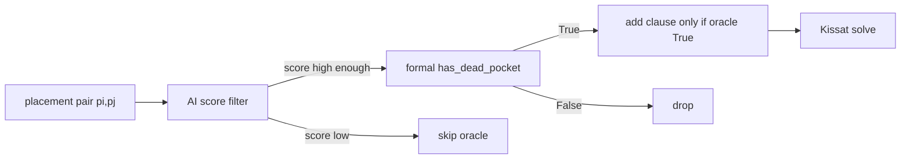
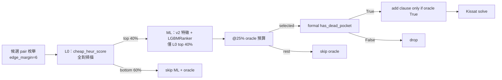

# Learned Dead-Pocket（Formal + AI）實驗報告

> **專案**：`new_puzzle_2026`  
> **方法**：AI 預篩 placement pair → 僅對高分候選呼叫 formal `has_dead_pocket` oracle → 確認後才加 `¬pi∨¬pj`  
> **Soundness**：AI 假陽性由 oracle 擋下；假陰性只漏剪枝，**never UNSOUND**  
> **詳解**：[EXPERIMENTS_DETAILED.md](./EXPERIMENTS_DETAILED.md)  
> **最後更新**：2026-06-18（含 v123 無 L0 @25%/@50% CNF、v6 break-even k=100）  

---

## 目錄

1. [Pipeline](#1-pipeline簡報核心圖)
2. [ML 訓練結果（RF）](#2-ml-訓練結果training_reportjson)
3. [Phase 1 — Oracle 效率曲線](#3-phase-1--oracle-效率曲線top-k-sweep)
4. [Phase 2 — SAT](#4-phase-2--d4-blocking--10-seed-sat)
5. [一句話結論](#5-一句話結論)
6. [重現指令（RF 基線）](#6-重現指令)
7. [General-Purpose Ranker（LOO）](#7-general-purpose-rankerv2-特徵--lightgbm-loo)
8. [v4 Zero-Shot + L0 Cascade](#8-v4-zero-shot--l0-cascade2026-06-16)
9. [v5 Hold-Out](#9-v5-hold-out--v123-l0-cascade2026-06-16)
10. [v6 Hold-Out](#10-v6-hold-out--v123-l0-cascade2026-06-17)
11. [v12345 → v6](#11-v12345-合訓--v6-hold-out2026-06-17)
12. [v6 Break-even](#12-v6-break-even連續枚舉累積時間2026-06-18)
13. [輸出檔案](#13-輸出檔案含-ranker)

---

## 1. Pipeline（簡報核心圖）

### 1.1 基礎版（無 L0，訓練 / sweep 上限）



### 1.2 部署版（L0 Cascade + @25%）

端到端 benchmark 與 CNF 生成實際走 **兩段預篩**：先用極便宜的 L0 幾何啟發式砍掉大部分 pair，再對存活對跑完整 ML ranker，最後才進 oracle。



**預設參數**：`LEARNED_SHAPE_CASCADE_L0=0.4`（L0 保留 40%）＋ `LEARNED_SHAPE_TOP_K=25`（對**全部**候選對取 top 25% 進 oracle）。  
**代價**：cascade @25% recall 約 **33–35%**（低於無 L0 的 **38–45%**），換取 build 明顯加速（v4/v6 實測見 §8–§10）。

**模組對照**

| 元件 | 檔案 |
|------|------|
| 幾何特徵 v1 / **v2** | `encoding/dead_pocket_features.py`, **`dead_pocket_features_v2.py`** |
| **L0 便宜啟發式** | **`dead_pocket_features_v2.cheap_heur_score()`** |
| 候選 pair 枚舉 | `encoding/dead_pocket_pairs.py` |
| 資料集 / 訓練 | `build_dead_pocket_dataset.py`, `train_dead_pocket_model.py`, **`train_dead_pocket_ranker.py`** |
| 子句生成 | `encoding/learned_shape.py` |
| CNF 整合 | `encoding/generate_cnf.py`（`method=learned_shape`） |
| 實驗編排 | `encoding/run_learned_shape_benchmark.py` |


## 2. ML 訓練結果（`training_report.json`）

**模型**：RandomForest + `class_weight=balanced`（部署預設 **Split-B** `model_splitB.joblib`）

### Split-A：v1 訓練 → v2 測試（跨拼圖泛化）

| 指標 | Train (v1 子樣本) | Test (v2 全量) |
|------|-------------------|----------------|
| Precision | 0.693 | 0.973 |
| Recall | 1.000 | **0.696** |
| F1 | 0.819 | 0.811 |
| ROC-AUC | 0.995 | 0.800 |
| Recall@10% top-K | 0.641 | **0.107** |

跨拼圖泛化偏弱；部署與 sweep 以 **Split-B** 為主。

### Split-B：v1+v2 混合 80/20

| 指標 | Train | Test |
|------|-------|------|
| Precision | 0.990 | 0.989 |
| Recall | 0.939 | **0.938** |
| F1 | 0.964 | 0.963 |
| ROC-AUC | 0.992 | 0.990 |
| Recall@10% top-K | 0.134 | 0.134 |

**特徵**：33 維（piece 組合、bbox、邊距、overlap/gap、free proxy 等），見 `training_report.json` → `feature_names`。

---

## 3. Phase 1 — Oracle 效率曲線（top-K sweep）

學習目標與 **shape′ 全盤 dead-pocket** 一致（`edge_margin=6`）。  
`clause_recall_vs_full` = 相對 full formal dead-pair 集合的子句召回率。

### v2（6,120 placements，11,085,192 候選對）

| top-K% | Oracle 呼叫 | Oracle 比例 | 子句數 | Clause recall | Oracle 秒 | 總秒 |
|--------|-------------|-------------|--------|---------------|-----------|------|
| 1 | 110,852 | 1.0% | 109,082 | 7.4% | 8.6 | 302 |
| 5 | 554,260 | 5.0% | 506,409 | 34.4% | 50.7 | 320 |
| 10 | 1,108,520 | 10.0% | 916,365 | 62.2% | 100.2 | 382 |
| 25 | 2,771,298 | 25.0% | 1,421,304 | 96.5% | 227.1 | 501 |
| **50** | **5,542,596** | **50.0%** | **1,470,755** | **99.8%** | **491.7** | **778** |
| 100 | 11,085,192 | 100% | 1,473,160 | 100% | 962.9 | 1,250 |

Full formal 掃描（快取）：1,473,160 dead pairs，945 s（`full_dead_v2.json`）。

**v2 選定 K\* = 50%**（最小 top-K 使 recall ≥ 99%）。

### v1（7,464 placements，16,726,136 候選對）

| top-K% | Oracle 呼叫 | Oracle 比例 | 子句數 | Clause recall | Oracle 秒 | 總秒 |
|--------|-------------|-------------|--------|---------------|-----------|------|
| 1 | 167,262 | 1.0% | 131,838 | 7.0% | 13.1 | 513 |
| 5 | 836,307 | 5.0% | 563,378 | 30.0% | 75.9 | 498 |
| 10 | 1,672,614 | 10.0% | 975,763 | 51.9% | 152.0 | 577 |
| 25 | 4,181,534 | 25.0% | 1,588,957 | 84.5% | 337.0 | 790 |
| 50 | 8,363,068 | 50.0% | 1,840,787 | 97.8% | 780.1 | 1,188 |
| **100** | **16,726,136** | **100%** | **1,881,352** | **100%** | **1,467.3** | **1,923** |

**v1 選定 K\* = 100%**（50% 僅 97.8% recall，未達 99% 門檻）。

### Trade-off 解讀（killer 圖數據）

- **v2 @50%**：Oracle BFS 呼叫 **減半**（5.5M vs 11.1M），子句 recall **99.8%**，oracle 時間 **~2× 加速**（492 s vs 963 s @100%）。
- **代價**：仍需對全部候選對做 ML 特徵 + `predict_proba`（推理成本固定）。
- 原始 JSON：`sweep_v1.json`、`sweep_v2.json`。

---

## 4. Phase 2 — D4 blocking + 10 seed SAT

設定同 [`baselines/d4_next_sol_seeds/SUMMARY.md`](../d4_next_sol_seeds/SUMMARY.md)。

### v2 求解時間（秒）

| 方法 | 平均 | 中位數 | vs baseline | CNF 產生 (s) | 備註 |
|------|------|--------|-------------|--------------|------|
| baseline | 11.35 | 10.09 | 1.00× | 21.9 | |
| shape / shape′ | **6.63** | 7.57 | **1.71×** | ~724 | full formal |
| **learned @50%** | 11.99 | — | 0.95× | **764** | recall 99.8% |
| **learned @100%** | 16.50 | — | 0.69× | 1,315 | 同 full 子句集 |

### v1 求解時間（秒）

| 方法 | 平均 | vs baseline | CNF 產生 (s) | 備註 |
|------|------|-------------|--------------|------|
| baseline | 27.88 | 1.00× | 35.8 | |
| shape / shape′ | **12.66** | **2.20×** | ~1,128 | full formal |
| **learned @100%** | **20.06** | **1.39×** | **1,867** | recall 100% |

**驗證**：v1 / v2 learned 皆 10/10 SAT、valid、D4 互異 10/10（`baselines/{v1,v2}/learned_shape/results.json`）。

---

## 5. 一句話結論

> **AI 將 formal dead-pocket oracle 呼叫減少 50%（v2），保留 99.8% 剪枝子句；CNF 生成 oracle 階段約 2× 加速，且全程 sound（僅 oracle 確認後加子句）。**  
> SAT 求解加速仍主要來自 full formal shape；learned @50% 在 v2 上接近 baseline 求解時間，因漏掉 ~0.2% 子句。v1 需 K=100% 才能達 99%+ recall。

---

## 6. 重現指令

```bash
cd encoding

# 資料 + 模型
python3 build_dead_pocket_dataset.py --puzzle v1 v2
python3 train_dead_pocket_model.py

# Phase 1 sweep
python3 run_learned_shape_benchmark.py --phase sweep --puzzle v1 v2

# Phase 2 SAT（K* 依 sweep 結果）
python3 run_learned_shape_benchmark.py --phase sat --puzzle v2 --top-k 50 100
python3 run_learned_shape_benchmark.py --phase sat --puzzle v1 --top-k 100

# 環境變數（單次 CNF）
export LEARNED_SHAPE_MODEL=../baselines/learned_shape/model_splitB.joblib
export LEARNED_SHAPE_TOP_K=50
export LEARNED_SHAPE_FULL_PAIRS=0
python3 generate_cnf.py --puzzle v2 --method learned_shape --out cnf/v2/learned_shape.cnf
```

---

## 7. General-Purpose Ranker（v2 特徵 + LightGBM LOO）

**目標**：拼圖不變特徵 + ranking 模型，leave-one-out（v1↔v2）驗證跨拼圖泛化；僅 oracle top-25% 時 SAT 接近 full shape。

### 7.1 新增模組

| 元件 | 檔案 |
|------|------|
| Puzzle-invariant 特徵 v2 | `encoding/dead_pocket_features_v2.py` |
| 分層 neg + v2 資料集 | `encoding/build_dead_pocket_dataset.py --features v2` |
| LightGBM ranker LOO | `encoding/train_dead_pocket_ranker.py` |
| Ranker 推理 / sweep 快取 | `encoding/learned_shape.py` |
| Canonical CNF 排序 | `encoding/generate_cnf.py` `write_cnf()` |
| LOO benchmark | `run_learned_shape_benchmark.py --loo` |

### 7.2 訓練（`ranker_training_report.json`）

| LOO fold | 模型 | Eval Recall@25% | Eval AUC |
|----------|------|-----------------|----------|
| train v1 → eval v2 | `ranker_loo_v1_train.joblib` | **26.9%** | 0.559 |
| train v2 → eval v1 | `ranker_loo_v2_train.joblib` | **36.2%** | 0.628 |

P1 門檻 Recall@25% ≥ 85%：**未達**（舊 RF Split-A 為 26.7%）。

### 7.3 LOO Phase 1 — Clause recall 曲線

**Eval v2（train v1）** — `sweep_v2_train_v1.json`

| top-K% | Clause recall | Oracle 比例 |
|--------|---------------|-------------|
| 25 | **38.2%** | 25% |
| 50 | 65.7% | 50% |
| 100 | 100% | 100% |

**Eval v1（train v2）** — `sweep_v1_train_v2.json`

| top-K% | Clause recall | Oracle 比例 |
|--------|---------------|-------------|
| 25 | **54.3%** | 25% |
| 50 | 78.4% | 50% |
| 100 | 100% | 100% |

P0 門檻 LOO @25% clause recall ≥ 99%：**未達**；兩 fold 皆需 **K\*=100%** 才達 99%+。

### 7.4 LOO Phase 2 — SAT（D4 + 10 seed）

**v2 eval（train v1 ranker）** vs baseline 11.35 s / shape 6.63 s：

| 方法 | SAT 平均 | vs baseline | vs shape | Clause recall |
|------|----------|-------------|----------|---------------|
| ranker LOO @25% | 14.41 s | 0.79× | 2.17× | 38% |
| ranker LOO @50% | 14.35 s | 0.79× | 2.16× | 66% |
| ranker LOO @100% | **9.69 s** | **1.17×** | 1.46× | 100% |

**v1 eval（train v2 ranker）** vs baseline 27.88 s / shape 12.66 s：

| 方法 | SAT 平均 | vs baseline | vs shape | Clause recall |
|------|----------|-------------|----------|---------------|
| ranker LOO @25% | 20.36 s | **1.37×** | 1.61× | 54% |
| ranker LOO @50% | 18.03 s | **1.55×** | 1.42× | 78% |
| ranker LOO @100% | 18.60 s | **1.50×** | 1.47× | 100% |

P0 SAT @25%（≤1.15× shape 且 ≥1.3× baseline）：**未達**。

### 7.5 結論（Ranker 計畫）

- **Pipeline 完成**：v2 特徵、分層資料、LightGBM ranker、canonical CNF、LOO sweep/SAT 皆可重現。
- **跨拼圖 @25% 仍不足**：clause recall 38–54%，SAT 慢於 baseline（v2）或僅略快（v1）。
- **同拼圖 full oracle（@100%）** 在 v2 上 SAT 9.69 s，略快 baseline 但仍慢於 shape 6.63 s。
- **下一步**（計畫 Phase 5 fallback）：提高 K 至 50–100%、hard-negative mining、12×12 bitmap 特徵；**v4 上 L0@25% 已出現預處理 + SAT 雙贏**（見 §8）。

### 7.6 重現（Ranker）

```bash
cd encoding
pip install lightgbm

python3 build_dead_pocket_dataset.py --puzzle v1 v2 --features v2
python3 train_dead_pocket_ranker.py --loo --features v2

python3 run_learned_shape_benchmark.py --phase sweep --loo --features v2
python3 run_learned_shape_benchmark.py --phase sat --loo --top-k 25 50 100 --features v2

export DEAD_POCKET_FEATURES=v2
export LEARNED_SHAPE_MODEL=../baselines/learned_shape/ranker_loo_v1_train.joblib
export LEARNED_SHAPE_TOP_K=25
python3 generate_cnf.py --puzzle v2 --method learned_shape --out /tmp/test.cnf
```

---

## 8. v4 Zero-Shot + L0 Cascade（2026-06-16）

**拼圖 v3/v4** 已加入 `puzzle_defs.py`；v4 為 hold-out，用於跨拼圖泛化與 L0 cascade 端到端測試。

### 8.1 Zero-Shot Sweep（eval v4，full dead = 1,630,496）

| 訓練 / 模式 | @25% recall | @50% recall | sweep 檔 |
|-------------|-------------|-------------|----------|
| v1 only | 39.6% | 63.7% | `sweep_v4_train_v1.json` |
| v2 only | **47.0%** | 68.7% | `sweep_v4_train_v2.json` |
| v123，無 L0 | 42.1% | **70.7%** | `sweep_v4_train_v1_v2_v3.json` |
| v123，**L0 cascade 0.4** | **34.72%** | 53.34% | `sweep_v4_train_v1_v2_v3_l00p4.json` |

合訓 v123 在低 K 較強、@50% 最佳，但 **@25% 仍不如 v2-only**；**cascade @25%（34.7%）** 與 v123 端到端 +566,171 子句（34.7% full shape）一致。三者皆遠低於 P0（99%）。

### 8.2 L0 Cascade + @25% 端到端（v4）

**腳本**：`encoding/run_v4_l0_benchmark.py`  
**設定**：`LEARNED_SHAPE_TOP_K=25`，`LEARNED_SHAPE_CASCADE_L0=0.4`（L0 heur 保留 top 40% pairs 再跑 ML）

#### 共同參考（baseline / shape，只跑一次）

| 方法 | build 秒 | 額外 dead-pocket 子句 |
|------|----------|----------------------|
| baseline | 37 | — |
| **shape**（全掃） | **2,437** | +1,630,496 |

#### v2-only vs v123 合訓 — 預處理（CNF build）

| 模型 | ranker 檔 | build 秒 | L0 / ML / oracle | 額外子句 | vs shape |
|------|-----------|----------|----------------|----------|----------|
| **v2-only** | `ranker_loo_v2_train.joblib` | **1,809** | 49s / 648s / 648s | +604,265（37%） | **1.35× 快** |
| **v1+v2+v3** | `ranker_train_v1_v2_v3.joblib` | **999** | 33s / 392s / 344s | +566,171（35%） | **2.44× 快** |

#### v2-only vs v123 合訓 — SAT（D4 + 10 seed Kissat）

| 模型 | 平均求解 | vs baseline | vs shape |
|------|----------|-------------|----------|
| baseline | 47.0 s | 1.00× | — |
| shape | 24.1 s | 1.95× | 1.00× |
| **v2-only L0@25%** | **21.4 s** | **2.20×** | **1.13× 快** |
| v123 L0@25% | 28.1 s | 1.67× | 0.86×（慢於 shape） |

10/10 SAT、valid ✅

**產出**：

- v2-only：`baselines/v4/l0_benchmark/v4_l0_benchmark.json`
- v123：`baselines/v4/l0_benchmark/v4_l0_benchmark_v123.json`
- 並排：`baselines/v4/l0_benchmark/v4_l0_compare_v2_vs_v123.md`

### 8.3 v123 CNF build 補跑（無 L0 + L0@50%，2026-06-18）

**腳本**：`run_v4_l0_benchmark.py`（`--no-l0` 或 `--cascade-l0 0.4`）；無 L0 一鍵：`run_v4_v123_no_l0_chain.sh`  
**模型**：`ranker_train_v1_v2_v3.joblib`  
**目的**：補齊簡報表一 — sweep recall 已有，補 **實際 CNF build**；無 L0 @25% 另跑 SAT。

| 設定 | sweep recall | CNF build (s) | 額外 dead 子句 | vs shape | SAT mean（D4, 10 seed） |
|------|-------------|---------------|----------------|----------|-------------------------|
| v123 **無 L0 @25%** | 42.1% | **1,195** | +687,057（42%） | **2.04× 快** | **28.3 s**（0.85× shape） |
| v123 **無 L0 @50%** | 70.7% | **1,761** | +1,152,910（71%） | **1.38× 快** | （未跑，`--cnf-only`） |
| v123 **L0@25%**（對照） | 34.7% | **999** | +566,171（35%） | **2.44× 快** | **28.1 s** |
| v123 **L0@50%** | 53.3% | **1,233** | +869,762（53%） | **1.98× 快** | （未跑，`--cnf-only`） |
| shape（對照） | 100% | **2,437** | +1,630,496 | 1.00× | **24.1 s** |

**觀察**：

- 四種 learned 變體 CNF **皆快於 full shape**（2437 s）；無 L0 @50%（1761 s）並非比 shape 慢。
- **L0@50%**（1233 s）比無 L0 @50%（1761 s）省 **~528 s**（L0 縮小 ML 範圍）；子句 +869,762 與 sweep 53.3% 一致。
- 無 L0 @25% SAT（28.3 s）與 L0@25%（28.1 s）**幾乎相同**；L0 主要省 build，對 v123@v4 SAT 幫助有限。
- 部署仍用 **L0@25%**（build 最快 999 s）；@50% 數據供簡報表一與 recall/build 取捨對照。

**產出**：`v4_v123_no_l0_k25.json`、`v4_v123_no_l0_k50.json`、`v4_v123_l0_k50.json`；`cnf_manifest.json` 已登錄。

### 8.4 解讀

- **預處理**：L0 cascade 使 learned 皆快於 full shape；**v123 L0@25% 最快（999 s）**；L0@50% **1,233 s**；無 L0 @25%/**@50%** 為 1195 / 1761 s；shape 2437 s。
- **SAT（主要 KPI）**：**v2-only 最佳**（21.4 s，快於 shape 與 baseline）；v123 L0@25% **28.1 s 慢於 shape**；無 L0 @25% 28.3 s，與 L0 版幾乎無差。
- **與 sweep 一致**：v2-only @25% recall 47.0% > v123 42.1% → 端到端 SAT 優勢也在 v2-only。
- **部署建議（v4）**：若目標是 **SAT 加速**，用 **v2-only ranker**；合訓 v123 在 @50% recall 較強，但 @25% 預算下不佔優；**L0 是 build 優化，不是 SAT 魔法**。
- **限制**：單一 hold-out 拼圖；v1/v2 LOO @25% recall 仍 38–54%；預處理仍需 **~17–30 min**。

### 8.5 重現（v4 L0 / 無 L0）

```bash
cd encoding

# v2-only（完整 baseline + shape + learned）
python3 run_v4_l0_benchmark.py --all

# v123 合訓（只跑 learned，重用 baseline/shape 快取）
python3 run_v4_l0_benchmark.py --all --learned-only \
  --model ../baselines/learned_shape/ranker_train_v1_v2_v3.joblib \
  --learned-tag learned_l0_k25_v123 \
  --report-name v4_l0_benchmark_v123.json

# 並排比較
python3 compare_v4_l0_models.py

export LEARNED_SHAPE_CASCADE_L0=0.4
python3 run_learned_shape_benchmark.py --phase sweep \
  --train-puzzle v1 v2 v3 --eval-puzzle v4 --features v2 \
  --cascade-l0 0.4 \
  --model ../baselines/learned_shape/ranker_train_v1_v2_v3.joblib

# v123 無 L0 @25% CNF+SAT、@50% CNF only
bash run_v4_v123_no_l0_chain.sh
# 或單獨：
python3 run_v4_l0_benchmark.py --puzzle v4 --all --learned-only --no-l0 \
  --top-k 25 --model ../baselines/learned_shape/ranker_train_v1_v2_v3.joblib \
  --learned-tag learned_k25_v123_no_l0 \
  --report-name v4_v123_no_l0_k25.json --force-regen-cnf
python3 run_v4_l0_benchmark.py --puzzle v4 --cnf-only --learned-only --no-l0 \
  --top-k 50 --model ../baselines/learned_shape/ranker_train_v1_v2_v3.joblib \
  --learned-tag learned_k50_v123_no_l0 \
  --report-name v4_v123_no_l0_k50.json --force-regen-cnf

# v123 L0@50% CNF only
python3 run_v4_l0_benchmark.py --puzzle v4 --cnf-only --learned-only \
  --top-k 50 --cascade-l0 0.4 \
  --model ../baselines/learned_shape/ranker_train_v1_v2_v3.joblib \
  --learned-tag learned_l0_k50_v123 \
  --report-name v4_v123_l0_k50.json --force-regen-cnf
```

---

## 9. v5 Hold-Out + v123 L0 Cascade（2026-06-16）

**拼圖 v5** 的形狀與已知解已加入 `encoding/puzzle_defs.py`；**v5 為 hold-out**（未納入 v123 合訓）。本節僅用 **v1+v2+v3 合訓 ranker**（`ranker_train_v1_v2_v3.joblib`）。

### 9.1 Zero-Shot Sweep（eval v5，full dead = 1,540,280）

| 模式 | @25% recall | @50% recall | sweep 檔 |
|------|-------------|-------------|----------|
| v123，**無 L0**（全量 ML） | **44.97%** | 74.06% | `sweep_v5_train_v1_v2_v3.json` |
| v123，**L0 cascade 0.4** | **34.21%** | 52.12% | `sweep_v5_train_v1_v2_v3_l00p4.json` |

**解讀**：

- **無 L0 sweep** 評估 ranker 理想排序（上限）；@25% 44.97%，對照 v4 同模型 42.1%（+2.9 pp）。
- **cascade sweep** 與端到端部署一致（L0 heur 保留 top 40% 再 ML）；@25% **34.21%**，比無 L0 **低 ~10.8 pp**。
- 端到端 CNF 的 +526,975 子句 = 34.2% full shape，與 cascade sweep @25% **一致**（CNF build log 的 recall=1.0 是相對 oracle 子集，非 full shape）。

### 9.2 L0 Cascade + @25% 端到端（v5，v123 only）

**腳本**：`encoding/run_v4_l0_benchmark.py --puzzle v5`  
**設定**：`LEARNED_SHAPE_TOP_K=25`，`LEARNED_SHAPE_CASCADE_L0=0.4`

| 方法 | build 秒 | 額外 dead-pocket 子句 | SAT mean（10 seed） | vs baseline | vs shape |
|------|----------|----------------------|---------------------|-------------|----------|
| baseline | 40 | — | 36.5 s | 1.00× | — |
| **shape**（全掃） | **2,409** | +1,540,280 | **21.9 s** | 1.67× | 1.00× |
| **v123 L0@25%** | **1,850** | +526,975（34%） | **22.7 s** | 1.61× | 0.97× |

10/10 SAT、valid ✅

**產出**：

- sweep：`baselines/learned_shape/sweep_v5_train_v1_v2_v3.json`
- dataset：`baselines/learned_shape/dataset_v5_v2.csv`
- full dead 快取：`baselines/learned_shape/full_dead_v5.json`
- 端到端：`baselines/v5/l0_benchmark/v5_l0_benchmark_v123.json`

### 9.3 解讀（v4 vs v5）

| 指標 | v4（v123） | v5（v123） |
|------|------------|------------|
| @25% recall（sweep，無 L0） | 42.1% | **44.97%** |
| @25% recall（sweep，L0=0.4） | **34.72%** | **34.21%** |
| learned build vs shape | 2.44× 快 | 1.30× 快 |
| SAT learned vs shape | 0.86×（慢） | **0.97×（接近）** |

v5 上 v123 **SAT 不再明顯落後 shape**（22.7s vs 21.9s），與 v4 上 v123 慢於 shape（28.1s vs 24.1s）形成對照；仍僅單一 hold-out，需更多拼圖驗證。

### 9.4 重現（v5）

```bash
cd encoding

# dataset（hold-out 標籤用，不參與 v123 訓練）
python3 build_dead_pocket_dataset.py --puzzle v5 --features v2

# zero-shot sweep（v123 → v5，無 L0）
python3 run_learned_shape_benchmark.py --phase sweep \
  --train-puzzle v1 v2 v3 --eval-puzzle v5 --features v2 \
  --model ../baselines/learned_shape/ranker_train_v1_v2_v3.joblib

# cascade sweep（L0=0.4，與端到端一致）
python3 run_learned_shape_benchmark.py --phase sweep \
  --train-puzzle v1 v2 v3 --eval-puzzle v5 --features v2 \
  --cascade-l0 0.4 \
  --model ../baselines/learned_shape/ranker_train_v1_v2_v3.joblib

# L0 端到端 SAT
python3 run_v4_l0_benchmark.py --all --puzzle v5 \
  --model ../baselines/learned_shape/ranker_train_v1_v2_v3.joblib \
  --learned-tag learned_l0_k25_v123 \
  --report-name v5_l0_benchmark_v123.json
```

---

## 10. v6 Hold-Out + v123 L0 Cascade（2026-06-17）

**拼圖 v6** 的形狀與已知解已加入 `encoding/puzzle_defs.py`；**v6 為 hold-out**（未納入 v123 合訓）。7432 placements，full dead = **2,107,368**（三個 hold-out 中最多）。

### 10.1 Zero-Shot Sweep（eval v6）

| 模式 | @25% recall | @50% recall | sweep 檔 |
|------|-------------|-------------|----------|
| v123，**無 L0** | **37.76%** | 66.99% | `sweep_v6_train_v1_v2_v3.json` |
| v123，**L0 cascade 0.4** | **33.84%** | 51.94% | `sweep_v6_train_v1_v2_v3_l00p4.json` |

L0 預篩再降 **~3.9 pp**（37.8% → 33.8%），幅度小於 v4/v5（~8–11 pp），可能因 v6 dead-pair 密度更高、L0 heur 保留集已較富。

### 10.2 L0 Cascade + @25% 端到端（v6，v123 only）

| 方法 | build 秒 | 額外 dead-pocket 子句 | SAT mean（10 seed） | vs baseline | vs shape |
|------|----------|----------------------|---------------------|-------------|----------|
| baseline | 42 | — | 49.9 s | 1.00× | — |
| **shape**（全掃） | **2,061** | +2,107,368 | **32.3 s** | 1.54× | 1.00× |
| **v123 L0@25%** | **1,461** | +713,098（34%） | **43.2 s** | 1.16× | **0.75×（慢）** |

10/10 SAT、valid ✅ — 但 **learned SAT 明顯慢於 shape**（43.2s vs 32.3s），是三個 hold-out 中表現最差的一例。

**產出**：

- dataset：`baselines/learned_shape/dataset_v6_v2.csv`（455k rows）
- sweep / cascade：`sweep_v6_train_v1_v2_v3.json`、`sweep_v6_train_v1_v2_v3_l00p4.json`
- full dead：`full_dead_v6.json`（公開版收錄於 GitHub Release，見 `ARTIFACTS.md`）
- 端到端：`baselines/v6/l0_benchmark/v6_l0_benchmark_v123.json`
- 編排：`run_learned_shape_benchmark.py` + `run_v4_l0_benchmark.py`

### 10.3 三 hold-out 橫向對照（v123，L0=0.4，@25% oracle 預算）

| 拼圖 | cascade @25% recall | 無 L0 @25% | learned build vs shape | SAT learned vs shape |
|------|---------------------|------------|------------------------|----------------------|
| v4 | 34.72% | 42.1% | 2.44× 快 | 0.86×（慢） |
| v5 | 34.21% | 44.97% | 1.30× 快 | **0.97×（接近）** |
| v6 | 33.84% | 37.76% | 1.41× 快 | **0.75×（慢）** |

**小結**：

- **cascade @25% recall 穩定在 ~34%**（三盤 33.8–34.7%），遠低於 P0；L0 預篩是主要 recall 損失來源（無 L0 高 4–11 pp）。
- **SAT 結果拼圖依賴強**：v5 接近 shape，v4/v6 慢於 shape；**不能從單一 hold-out 宣稱 general-purpose 達標**。
- v6 dead-pair 最多、baseline SAT 最慢（50s），learned 子句 recall 雖與 v4/v5 同級，**剪枝子句品質不足**導致 SAT 無優勢。

### 10.4 連續枚舉 5 解（D4 block known，`run_enum_benchmark.py`）

| 方法 | 平均求解 (5解) | vs baseline | vs shape |
|------|----------------|-------------|----------|
| baseline | **47.2 s** | 1.00× | — |
| shape | 50.0 s | 0.94× | 1.00× |
| **learned L0@25%** | **42.0 s** | **1.12×** | **1.19×** |

5/5 valid ✅。**與 D4 下一解結論相反**：D4 上 learned 慢於 shape（43.2 vs 32.3s），枚舉軌跡下 **learned 最快**（標準差也較小）。解的順序依方法而異，兩種基準互補。

產出：`baselines/v6/enum_v2/RESULTS_prune.md`、`results.json`

### 10.5 重現（v6）

```bash
cd encoding
python3 build_dead_pocket_dataset.py --puzzle v6 --features v2
python3 run_learned_shape_benchmark.py --phase sweep \
  --train-puzzle v1 v2 v3 --eval-puzzle v6 --features v2 --cascade-l0 0.4
python3 run_v4_l0_benchmark.py --puzzle v6 --all \
  --model ../baselines/learned_shape/ranker_train_v1_v2_v3.joblib \
  --learned-tag learned_l0_k25_v123 \
  --report-name v6_l0_benchmark_v123.json

# 連續 5 解枚舉（baseline / shape / learned）
python3 run_enum_benchmark.py --puzzle v6 --count 5 \
  --methods baseline shape learned_shape \
  --learned-model ../baselines/learned_shape/ranker_train_v1_v2_v3.joblib \
  --learned-top-k 25 --cascade-l0 0.4
```

---

## 11. v12345 合訓 → v6 Hold-Out（2026-06-17）

**模型**：`ranker_train_v1_v2_v3_v4_v5.joblib`（train v1–v5，**不含 v6**）  
**腳本**：`train_dead_pocket_ranker.py`、`run_learned_shape_benchmark.py`、
`run_v4_l0_benchmark.py`

### 11.1 Cascade Sweep @25%（v6）

| 模式 | @25% recall | sweep 檔 |
|------|-------------|----------|
| 無 L0（全量 ML） | **40.70%** | `sweep_v6_train_v1_v2_v3_v4_v5.json` |
| cascade L0=0.4 | **32.97%** | `sweep_v6_train_v1_v2_v3_v4_v5_l00p4.json` |

對照 v123（§10.1）：cascade 33.84% → 32.97%（略降）；無 L0 37.76% → 40.70%（略升）。

### 11.2 端到端 D4 SAT（learned-only，10 seed）

| 模型 | build 秒 | SAT mean | vs shape (32.3s) |
|------|----------|----------|------------------|
| v123 L0@25% | 1,461 | 43.2 s | 0.75×（慢） |
| **v12345 L0@25%** | **951** | **31.2 s** | **≈ 1.04×（接近）** |

10/10 SAT、valid ✅ — **合訓 v4/v5 後 v6 D4 SAT 達 full shape 水準**。

產出：`baselines/v6/l0_benchmark/v6_l0_benchmark_v12345.json`

### 11.3 v6 連續枚舉 5 解（learned-only，v12345）

| 方法 | 各次 (s) | 平均 (5解) | vs v123 枚舉 (41.97s) |
|------|----------|------------|----------------------|
| learned v12345 | [41.2, 62.1, 26.8, 54.5, 21.3] | **41.19 s** | ≈ 1.02×（幾乎相同） |

5/5 valid ✅。**枚舉 KPI 不敏感**；主 KPI 改善在 D4 next-sol（43.2 → 31.2s）。

產出：`baselines/v6/enum_v2_v12345/results.json`

### 11.4 v123 vs v12345 小結（v6）

| 指標 | v123 | v12345 | 解讀 |
|------|------|--------|------|
| cascade @25% recall | 33.84% | 32.97% | 略降 |
| D4 SAT mean | 43.2 s | **31.2 s** | **大幅改善，≈ shape** |
| 枚舉 5 解 mean | 41.97 s | 41.19 s | 幾乎不變 |

**主 KPI 以 D4 next-sol 為準**；更多訓練拼圖（v4/v5）顯著改善 v6 SAT，但 @25% recall 仍遠低 P0。

### 11.5 重現（v12345 → v6）

```bash
cd encoding
python3 build_dead_pocket_dataset.py --puzzle v4 v5 v6 --features v2
python3 train_dead_pocket_ranker.py \
  --train-puzzle v1 v2 v3 v4 v5 --eval-puzzle v6 --features v2
python3 run_v4_l0_benchmark.py --puzzle v6 --all --learned-only \
  --model ../baselines/learned_shape/ranker_train_v1_v2_v3_v4_v5.joblib \
  --learned-tag learned_l0_k25_v12345 \
  --report-name v6_l0_benchmark_v12345.json

# learned-only 枚舉 5 解
python3 run_enum_benchmark.py --puzzle v6 --count 5 --methods learned_shape \
  --learned-model ../baselines/learned_shape/ranker_train_v1_v2_v3_v4_v5.joblib \
  --learned-top-k 25 --cascade-l0 0.4 \
  --out-dir ../baselines/v6/enum_v2_v12345
```

---

## 12. v6 Break-even：連續枚舉累積時間（2026-06-18）

**詳細結果**：[RESULTS.md](../v6/break_even/RESULTS.md)

**問題**：封鎖已知解後 **D4 連續求下一解**，含 **一次 CNF build**，要枚舉多少解各方法總時間才贏 baseline？  
**腳本**：`encoding/run_break_even_benchmark.py`（支援 `--resume`）  
**設定**：v6；**v12345** ranker（L0=0.4，@25%）；**k_max=100**；方法 baseline / learned_shape / shape。

### 12.1 定義

- `累積(k) = CNF build（一次）+ Σ 前 k 次 Kissat`
- **k\***：該方法累積時間 **首次 < baseline** 的 k（1-based）

### 12.2 主結果（break-even 實測 build）

| 方法 | CNF build | 平均 solve | 100 解累積 | **k\* vs baseline** |
|------|-----------|------------|------------|---------------------|
| baseline | 31.5 s | 43.0 s | 4330 s | — |
| learned_shape | 938.3 s | 29.8 s | 3920 s | **68** |
| shape | 1232.5 s | 25.2 s | **3749 s** | **66** |

- **shape 最先反超 baseline**（k=66），learned 於 **k=68**；shape 於 **k≈40** 起累積贏 learned。
- k=1：僅 baseline 合理（build 31 s vs 938/1233 s）——**只找 1 個另解仍應 baseline**。
- 子句數與公平對照一致：baseline 65.4M / learned 66.1M / shape 67.5M。

產出：`baselines/v6/break_even/results.json`、`RESULTS.md`、`*_work.cnf`

### 12.3 CNF build 公平對照（同一時段連續跑）

**腳本**：`encoding/run_cnf_build_fair_compare.py`（2026-06-18 09:46–10:26）

| 方法 | build_cnf | write_cnf | clauses |
|------|-----------|-----------|---------|
| baseline | 31.7 s | 12.7 s | 65,393,099 |
| shape | **1314.7 s** | 20.4 s | 67,500,467 |
| learned_shape | **972.2 s** | 19.1 s | 66,087,849 |

**CNF 內容與 break-even / l0 manifest 相同**；shape build 歷史值 1233 s（break-even）與 2061 s（l0 manifest）為**同程式不同負載**，非不同剪枝強度。  
用公平 build 重算 k\*（solve 沿用 break-even 軌跡）：shape **71**、learned **74**——**相對順序不變**。

產出：`baselines/v6/cnf_build_fair/cnf_build_fair_compare.json`

### 12.4 與其他 KPI 的關係

| 情境 | 贏家 | 備註 |
|------|------|------|
| 只找 1 解（含 build） | baseline | build 31 s |
| D4 單解（CNF 已建） | learned ≈ shape | §11.2：31.2 s vs 32.3 s |
| 連續枚舉 ≥70 解（含 build） | **shape** > learned > baseline | 本實驗 |
| 新拼圖、有限 oracle | learned | 免每盤重寫 formal shape 規則 |

**簡報一句**：learned **不是白忙**——k=68 贏 baseline、build 比 shape 省 ~5 min；但 **v6 長枚舉賽道 full shape 仍最強**。

### 12.5 重現

```bash
cd encoding
# 首次 k=30
python3 run_break_even_benchmark.py --puzzle v6 --k-max 30 \
  --methods baseline learned_shape \
  --learned-model ../baselines/learned_shape/ranker_train_v1_v2_v3_v4_v5.joblib

# 接續到 100，再加 shape
python3 run_break_even_benchmark.py --puzzle v6 --k-max 100 --resume
python3 run_break_even_benchmark.py --puzzle v6 --k-max 100 --methods shape

# 公平 build 對照
python3 run_cnf_build_fair_compare.py --puzzle v6
```

---

---

---

## 13. 輸出檔案（含 Ranker）

| 路徑 | 內容 |
|------|------|
| `baselines/learned_shape/dataset_{v1,v2,v3,v4,v5,v6}_v2.csv` | v2 特徵訓練資料 |
| `baselines/learned_shape/ranker_loo_{v1,v2}_train.joblib` | LOO ranker |
| `baselines/learned_shape/ranker_training_report.json` | Ranker ML 指標 |
| `baselines/learned_shape/sweep_{eval}_train_{train}.json` | LOO / zero-shot sweep |
| `baselines/learned_shape/sweep_v4_train_{v1,v2,v1_v2_v3}.json` | v4 zero-shot sweep |
| `baselines/learned_shape/sweep_v4_train_v1_v2_v3_l00p4.json` | v4 cascade sweep（L0=0.4） |
| `baselines/learned_shape/sweep_v5_train_v1_v2_v3.json` | v5 zero-shot sweep（v123，無 L0） |
| `baselines/learned_shape/sweep_v5_train_v1_v2_v3_l00p4.json` | v5 cascade sweep（L0=0.4） |
| `baselines/learned_shape/sweep_v6_train_v1_v2_v3.json` | v6 zero-shot sweep（v123，無 L0） |
| `baselines/learned_shape/sweep_v6_train_v1_v2_v3_l00p4.json` | v6 cascade sweep（L0=0.4） |
| `baselines/learned_shape/ranker_train_v1_v2_v3.joblib` | 多拼圖合訓 ranker（v1–v3） |
| `baselines/learned_shape/ranker_train_v1_v2_v3_v4_v5.joblib` | 多拼圖合訓 ranker（v1–v5） |
| `baselines/learned_shape/sweep_v6_train_v1_v2_v3_v4_v5.json` | v6 sweep（v12345，無 L0） |
| `baselines/learned_shape/sweep_v6_train_v1_v2_v3_v4_v5_l00p4.json` | v6 cascade sweep（v12345） |
| `baselines/v4/l0_benchmark/v4_l0_benchmark.json` | v4 L0@25%（v2-only） |
| `baselines/v4/l0_benchmark/v4_l0_benchmark_v123.json` | v4 L0@25%（v123 合訓） |
| `baselines/v4/l0_benchmark/v4_v123_no_l0_k25.json` | v4 無 L0 @25%（CNF+SAT） |
| `baselines/v4/l0_benchmark/v4_v123_no_l0_k50.json` | v4 無 L0 @50%（CNF only） |
| `baselines/v4/l0_benchmark/v4_v123_l0_k50.json` | v4 L0@50%（CNF only） |
| `baselines/v4/l0_benchmark/v4_l0_compare_v2_vs_v123.md` | v2 vs v123 並排 |
| `baselines/v4/l0_benchmark/RESULTS.md` | v4 CNF 對照表與產物索引 |
| `encoding/run_v4_v123_no_l0_chain.sh` | v123 無 L0 一鍵補跑 |
| `baselines/v4/l0_benchmark/{baseline,shape,learned_l0_k25,learned_l0_k25_v123,learned_l0_k50_v123,learned_k25_v123_no_l0,learned_k50_v123_no_l0}_*.cnf` | v4 CNF 快取 |
| `baselines/v5/l0_benchmark/v5_l0_benchmark_v123.json` | v5 L0@25%（v123 合訓） |
| `baselines/v6/l0_benchmark/v6_l0_benchmark_v123.json` | v6 L0@25%（v123 合訓） |
| `baselines/v6/l0_benchmark/v6_l0_benchmark_v12345.json` | v6 L0@25%（v12345 合訓） |
| `encoding/puzzle_defs.py` | v1–v6 拼圖形狀與已知解 |
| GitHub Release（見 `ARTIFACTS.md`） | `full_dead_{v1,v2,v4,v5,v6}.json` 快取 |
| `baselines/v6/enum_v2/RESULTS_prune.md` | v6 枚舉 5 解（baseline/shape/learned + v12345） |
| `baselines/v6/enum_v2_v12345/results.json` | v6 枚舉（learned-only v12345） |
| `baselines/v6/break_even/results.json` | v6 break-even k=100（三方法） |
| [`baselines/v6/break_even/RESULTS.md`](../v6/break_even/RESULTS.md) | break-even 累積表 |
| `baselines/v6/cnf_build_fair/cnf_build_fair_compare.json` | v6 公平 build 對照 |
| `encoding/run_break_even_benchmark.py` | break-even 腳本（含 resume） |
| `encoding/run_cnf_build_fair_compare.py` | 公平 build 對照腳本 |
| `baselines/{v1,v2}/learned_shape/` | CNF、results.json |
